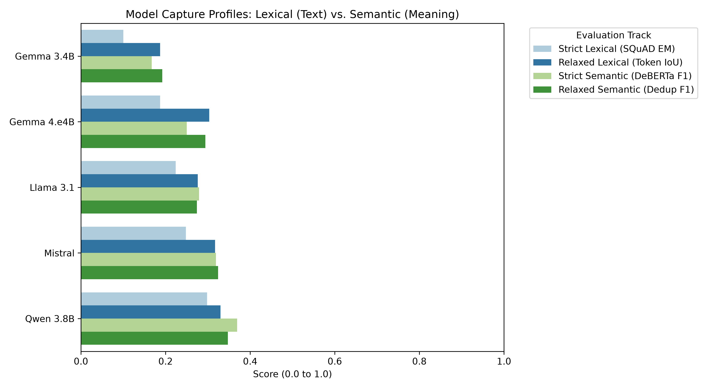
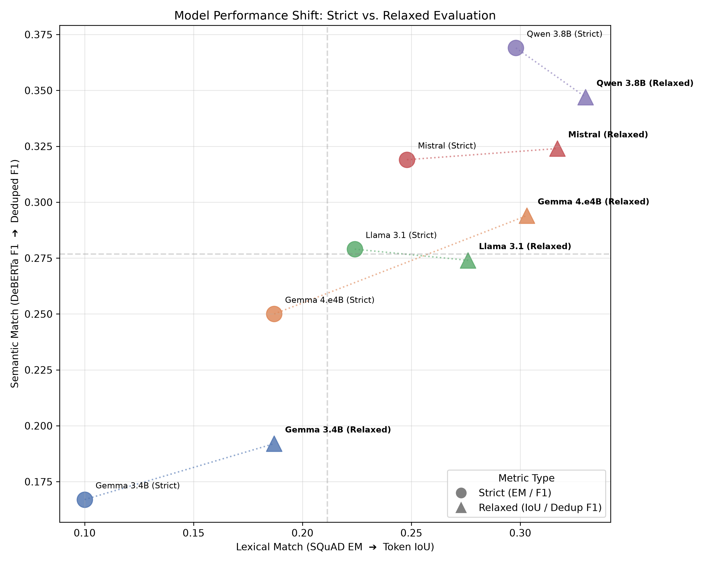

# LLM Evaluation Report

## 1. Inter-Annotator Agreement (Data Quality)

*Based on 96 overlapping articles.*

| Metric | Score |
|---|---|
| **Krippendorff's Alpha** (Ordinal) | 0.9051 |
| **ICC(2,k)** (Absolute Agreement) | 0.9665 |

## 2. Metric-to-Human Correlation

*Total Framework Samples: 96*

### Correlation Comparison: Strict vs. Relaxed Metrics

| Evaluation Dimension | Strict Metric | Relaxed Metric | Strict Spearman (ρ) | Relaxed Spearman (ρ) |
|---|---|---|---|---|
| **Lexical Match** | SQuAD EM | Token IoU | 0.7950 | **0.8242** |
| **Semantic Match** | DeBERTa F1 | Deduped DeBERTa F1 | 0.8178 | **0.8265** |

### Side-by-Side Ranking Comparison

| Rank   | Human Preference    | Strict Machine Preference (F1)   | Relaxed Machine Preference (Dedup F1)   |
|:-------|:--------------------|:---------------------------------|:----------------------------------------|
| #1     | Qwen 3.8B (0.346)   | Qwen 3.8B (0.369)                | Qwen 3.8B (0.347)                       |
| #2     | Llama 3.1 (0.285)   | Mistral (0.319)                  | Mistral (0.324)                         |
| #3     | Mistral (0.193)     | Llama 3.1 (0.279)                | Gemma 4.e4B (0.294)                     |
| #4     | Gemma 4.e4B (0.183) | Gemma 4.e4B (0.250)              | Llama 3.1 (0.274)                       |
| #5     | Gemma 3.4B (0.118)  | Gemma 3.4B (0.167)               | Gemma 3.4B (0.192)                      |

## 4. Error Analysis & Top Disagreements

*Evaluated on 45 complex edge-case rows.*

### Human Baseline Agreement (Complex Subset)

| Metric | Score |
|---|---|
| **Krippendorff's Alpha** | 0.8323 |
| **Intraclass Correlation ICC(2,k)** | 0.9380 |

### Strict vs. Relaxed Metric Correlation

| Evaluation Dimension | Strict Metric | Relaxed Metric | Strict Spearman (ρ) | Relaxed Spearman (ρ) |
|---|---|---|---|---|
| **Lexical Match** | SQuAD EM | Token IoU | 0.7138 | **0.6413** |
| **Semantic Match** | DeBERTa F1 | Deduped DeBERTa F1 | 0.8066 | **0.6668** |

### Delta Analysis (Top 5 Disagreements after Relaxation)

**Disagreement #1 (Score Delta: 0.7276)**
* **ID:** EVAL_088
* **Ground Truth:** `airstrike`
* **AI Prediction:** `air strike`
* **Scores:** Human = 1.0000 | Relaxed BERTScore = 0.2724

---

**Disagreement #2 (Score Delta: 0.5500)**
* **ID:** EVAL_005
* **Ground Truth:** `shells | shelling | bombing`
* **AI Prediction:** `shelling | shelling | shelling | shelling | shelling | shelling | shelling | shelling | shells`
* **Scores:** Human = 0.2500 | Relaxed BERTScore = 0.8000

---

**Disagreement #3 (Score Delta: 0.4404)**
* **ID:** EVAL_050
* **Ground Truth:** `bombings | shells | shelling | shelling | shelling | shelling | shelling`
* **AI Prediction:** `shells | heavy machineguns | heavy machineguns | shelling | shelling | shelling | shelling | shelling | shelling | bombings`
* **Scores:** Human = 0.4167 | Relaxed BERTScore = 0.8571

---

**Disagreement #4 (Score Delta: 0.3334)**
* **ID:** EVAL_072
* **Ground Truth:** `aerial bombardment | ieds`
* **AI Prediction:** `IEDs | fired | bombardment | bombardment | bombardment | aerial bombardment | Aerial bombardment`
* **Scores:** Human = 0.3333 | Relaxed BERTScore = 0.6667

---

**Disagreement #5 (Score Delta: 0.3334)**
* **ID:** EVAL_025
* **Ground Truth:** `air strikes | explosive barrels`
* **AI Prediction:** `warplanes | Warplanes | air strikes | explosive barrels | bombardment`
* **Scores:** Human = 0.3333 | Relaxed BERTScore = 0.6667

---

