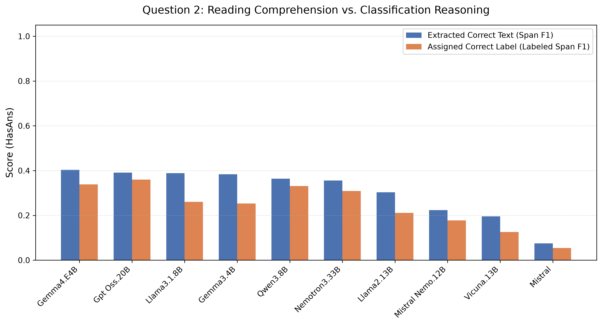

# LLM Evaluation Report
**Total Models Evaluated:** 13
**Total Documents Processed:** 1860
**Full Evaluation Compute Time:** 650.13 seconds

## Part 1: Global Benchmark Leaderboard (SQuAD 2.0 Evaluation)
> *All text metrics formatted as (Overall / HasAns)*

| Model               | Method    |   Doc Count |   Avg Spans |   Abstention (NoAns) |   Missed Answer Rate | Span F1 (Overall / HasAns)   | Labeled Span F1 (Overall / HasAns)   | SQuAD Token F1 (Overall / HasAns)   | BERTScore (Overall / HasAns)   | Deduped BERTScore (Overall / HasAns)   |
|:--------------------|:----------|------------:|------------:|---------------------:|---------------------:|:-----------------------------|:-------------------------------------|:------------------------------------|:-------------------------------|:---------------------------------------|
| Gpt Oss.20B         | Zero-Shot |        1860 |        3.34 |                 0.62 |                 0.04 | 0.53 / 0.44                  | 0.53 / 0.44                          | 0.60 / 0.58                         | 0.61 / 0.60                    | 0.61 / 0.60                            |
|                     | Cookbook  |        1860 |        0.42 |                 0.97 |                 0.81 | 0.49 / 0.01                  | 0.49 / 0.01                          | 0.49 / 0.01                         | 0.50 / 0.01                    | 0.50 / 0.01                            |
| Gemma4.E4B          | Zero-Shot |        1860 |        3.37 |                 0.6  |                 0.03 | 0.52 / 0.44                  | 0.51 / 0.43                          | 0.59 / 0.57                         | 0.59 / 0.58                    | 0.59 / 0.58                            |
|                     | Cookbook  |        1860 |        3.58 |                 0.59 |                 0.05 | 0.51 / 0.42                  | 0.50 / 0.40                          | 0.57 / 0.55                         | 0.58 / 0.56                    | 0.58 / 0.56                            |
| Qwen3.8B            | Zero-Shot |        1860 |        2.98 |                 0.56 |                 0.05 | 0.49 / 0.42                  | 0.49 / 0.42                          | 0.54 / 0.53                         | 0.55 / 0.55                    | 0.55 / 0.55                            |
| Llama3.1.8B         | Zero-Shot |        1860 |        3.53 |                 0.37 |                 0.04 | 0.39 / 0.40                  | 0.38 / 0.38                          | 0.44 / 0.51                         | 0.45 / 0.53                    | 0.45 / 0.53                            |
|                     | Cookbook  |        1860 |        4.62 |                 0.05 |                 0    | 0.22 / 0.39                  | 0.21 / 0.38                          | 0.30 / 0.55                         | 0.30 / 0.56                    | 0.30 / 0.55                            |
| Mistral Nemo.12B    | Zero-Shot |        1860 |        2.13 |                 0.57 |                 0.1  | 0.48 / 0.39                  | 0.48 / 0.39                          | 0.53 / 0.50                         | 0.55 / 0.52                    | 0.55 / 0.52                            |
| Mistral Nemo        | Cookbook  |        1860 |        2.24 |                 0.58 |                 0.09 | 0.48 / 0.39                  | 0.48 / 0.38                          | 0.54 / 0.49                         | 0.55 / 0.52                    | 0.55 / 0.52                            |
| Nemotron3 Nano Omni | Cookbook  |        1860 |        3    |                 0.8  |                 0.18 | 0.58 / 0.36                  | 0.58 / 0.36                          | 0.65 / 0.50                         | 0.65 / 0.50                    | 0.65 / 0.50                            |
| Gemma3.4B           | Zero-Shot |        1860 |        5.76 |                 0.17 |                 0.02 | 0.25 / 0.34                  | 0.24 / 0.32                          | 0.31 / 0.46                         | 0.32 / 0.48                    | 0.33 / 0.49                            |
|                     | Cookbook  |        1860 |        3.59 |                 0.8  |                 0.18 | 0.56 / 0.32                  | 0.56 / 0.32                          | 0.61 / 0.42                         | 0.62 / 0.44                    | 0.62 / 0.44                            |
| Nemotron3.33B       | Zero-Shot |         906 |        0.56 |                 0.8  |                 0.28 | 0.72 / 0.36                  | 0.71 / 0.31                          | 0.74 / 0.48                         | 0.74 / 0.46                    | 0.74 / 0.46                            |
| Mistral             | Zero-Shot |        1860 |        2.5  |                 0.73 |                 0.17 | 0.53 / 0.32                  | 0.53 / 0.32                          | 0.57 / 0.41                         | 0.58 / 0.43                    | 0.58 / 0.43                            |
|                     | Cookbook  |        1860 |        2.16 |                 0.69 |                 0.16 | 0.51 / 0.33                  | 0.51 / 0.32                          | 0.56 / 0.43                         | 0.57 / 0.44                    | 0.56 / 0.44                            |
| Vicuna.13B          | Zero-Shot |        1860 |        3.45 |                 0.65 |                 0.25 | 0.43 / 0.20                  | 0.42 / 0.19                          | 0.47 / 0.28                         | 0.46 / 0.27                    | 0.46 / 0.27                            |
| Llama2.13B          | Zero-Shot |        1860 |        1.45 |                 0.46 |                 0.45 | 0.30 / 0.14                  | 0.30 / 0.13                          | 0.32 / 0.18                         | 0.33 / 0.20                    | 0.33 / 0.20                            |
| Vicuna              | Cookbook  |        1860 |        2.5  |                 0.91 |                 0.67 | 0.47 / 0.02                  | 0.47 / 0.02                          | 0.48 / 0.04                         | 0.47 / 0.04                    | 0.47 / 0.03                            |

## Part 2: Visual Insights (Zero-Shot Baseline)

### 1. Abstention vs. Extraction Quality
> *Evaluates whether models are 'Ideal Performers' (safe and accurate) or 'Hallucinators' (talkative but unsafe).*

### 2. Strict vs. Relaxed Evaluation Shift
> *Visualizing the performance penalty models take when evaluated strictly (Span F1) vs. relaxed (Token/Semantic).*

### 3. Verbosity vs. Semantic Accuracy
> *Tracking whether models artificially inflate their extraction scores by over-generating spans.*

---

## Part 3: Task Complexity Breakdown

### Performance Degradation Heatmaps (Zero-Shot Baseline)
> *Overall Score (includes easy abstentions) vs. HasAns Score (true extraction capability).*

### Question 1 Leaderboard
| Model               | Method    |   Doc Count |   Avg Spans |   Abstention (NoAns) |   Missed Answer Rate | Span F1 (Overall / HasAns)   | Labeled Span F1 (Overall / HasAns)   | SQuAD Token F1 (Overall / HasAns)   | BERTScore (Overall / HasAns)   | Deduped BERTScore (Overall / HasAns)   |
|:--------------------|:----------|------------:|------------:|---------------------:|---------------------:|:-----------------------------|:-------------------------------------|:------------------------------------|:-------------------------------|:---------------------------------------|
| Gpt Oss.20B         | Zero-Shot |         954 |        5.87 |                 0.02 |                 0.01 | 0.37 / 0.45                  | 0.37 / 0.45                          | 0.48 / 0.59                         | 0.50 / 0.62                    | 0.50 / 0.61                            |
|                     | Cookbook  |         954 |        0.81 |                 0.88 |                 0.78 | 0.18 / 0.01                  | 0.18 / 0.01                          | 0.18 / 0.01                         | 0.19 / 0.02                    | 0.19 / 0.02                            |
| Nemotron3 Nano Omni | Cookbook  |         954 |        5.85 |                 0.01 |                 0    | 0.35 / 0.43                  | 0.35 / 0.43                          | 0.48 / 0.60                         | 0.49 / 0.61                    | 0.48 / 0.60                            |
| Gemma4.E4B          | Zero-Shot |         954 |        6.01 |                 0.02 |                 0    | 0.36 / 0.44                  | 0.36 / 0.44                          | 0.47 / 0.58                         | 0.48 / 0.60                    | 0.48 / 0.59                            |
|                     | Cookbook  |         954 |        6.45 |                 0    |                 0    | 0.35 / 0.43                  | 0.35 / 0.43                          | 0.46 / 0.57                         | 0.47 / 0.58                    | 0.47 / 0.59                            |
| Mistral Nemo        | Cookbook  |         954 |        3.73 |                 0.03 |                 0.03 | 0.35 / 0.43                  | 0.35 / 0.43                          | 0.43 / 0.53                         | 0.46 / 0.56                    | 0.46 / 0.57                            |
| Mistral Nemo.12B    | Zero-Shot |         954 |        3.53 |                 0.04 |                 0.04 | 0.35 / 0.43                  | 0.35 / 0.43                          | 0.43 / 0.53                         | 0.46 / 0.56                    | 0.46 / 0.56                            |
| Qwen3.8B            | Zero-Shot |         954 |        4.88 |                 0.03 |                 0.03 | 0.35 / 0.43                  | 0.35 / 0.43                          | 0.43 / 0.53                         | 0.46 / 0.56                    | 0.45 / 0.56                            |
| Llama3.1.8B         | Zero-Shot |         954 |        5.52 |                 0.02 |                 0.02 | 0.33 / 0.41                  | 0.33 / 0.41                          | 0.41 / 0.51                         | 0.43 / 0.54                    | 0.43 / 0.54                            |
|                     | Cookbook  |         954 |        5.62 |                 0    |                 0    | 0.32 / 0.40                  | 0.32 / 0.40                          | 0.44 / 0.55                         | 0.45 / 0.57                    | 0.45 / 0.56                            |
| Mistral             | Zero-Shot |         954 |        4.65 |                 0.06 |                 0.03 | 0.31 / 0.38                  | 0.31 / 0.38                          | 0.40 / 0.48                         | 0.41 / 0.50                    | 0.42 / 0.51                            |
|                     | Cookbook  |         954 |        3.79 |                 0.13 |                 0.05 | 0.32 / 0.37                  | 0.32 / 0.37                          | 0.41 / 0.48                         | 0.43 / 0.50                    | 0.42 / 0.50                            |
| Gemma3.4B           | Zero-Shot |         954 |        9.05 |                 0.01 |                 0.01 | 0.27 / 0.33                  | 0.27 / 0.33                          | 0.36 / 0.45                         | 0.38 / 0.47                    | 0.39 / 0.49                            |
|                     | Cookbook  |         954 |        7    |                 0.01 |                 0    | 0.31 / 0.39                  | 0.31 / 0.39                          | 0.41 / 0.51                         | 0.43 / 0.53                    | 0.43 / 0.53                            |
| Vicuna.13B          | Zero-Shot |         954 |        6.11 |                 0.29 |                 0.21 | 0.22 / 0.20                  | 0.22 / 0.20                          | 0.28 / 0.28                         | 0.28 / 0.27                    | 0.28 / 0.27                            |
| Llama2.13B          | Zero-Shot |         954 |        1.67 |                 0.46 |                 0.49 | 0.18 / 0.11                  | 0.18 / 0.11                          | 0.20 / 0.14                         | 0.22 / 0.15                    | 0.22 / 0.16                            |
| Vicuna              | Cookbook  |         954 |        4.87 |                 0.54 |                 0.59 | 0.13 / 0.03                  | 0.13 / 0.03                          | 0.15 / 0.05                         | 0.14 / 0.04                    | 0.14 / 0.04                            |

#### Plot A: Text Extraction Precision & Recall (Q1 - Zero-Shot)
> *This isolates reading comprehension: Did the model locate the correct phrases? HasAns-only bars at exact span match — one operating point per model.*

### Question 2 Leaderboard
| Model               | Method    |   Doc Count |   Avg Spans |   Abstention (NoAns) |   Missed Answer Rate | Span F1 (Overall / HasAns)   | Labeled Span F1 (Overall / HasAns)   | SQuAD Token F1 (Overall / HasAns)   | BERTScore (Overall / HasAns)   | Deduped BERTScore (Overall / HasAns)   |
|:--------------------|:----------|------------:|------------:|---------------------:|---------------------:|:-----------------------------|:-------------------------------------|:------------------------------------|:-------------------------------|:---------------------------------------|
| Gpt Oss.20B         | Zero-Shot |         906 |        0.67 |                 0.77 |                 0.21 | 0.70 / 0.39                  | 0.70 / 0.36                          | 0.73 / 0.53                         | 0.73 / 0.52                    | 0.73 / 0.52                            |
|                     | Cookbook  |         906 |        0.02 |                 1    |                 0.97 | 0.82 / 0.00                  | 0.82 / 0.00                          | 0.82 / 0.00                         | 0.82 / 0.00                    | 0.82 / 0.00                            |
| Gemma4.E4B          | Zero-Shot |         906 |        0.58 |                 0.75 |                 0.17 | 0.69 / 0.40                  | 0.68 / 0.34                          | 0.71 / 0.52                         | 0.71 / 0.51                    | 0.71 / 0.51                            |
|                     | Cookbook  |         906 |        0.55 |                 0.75 |                 0.24 | 0.67 / 0.35                  | 0.66 / 0.27                          | 0.70 / 0.46                         | 0.69 / 0.46                    | 0.69 / 0.46                            |
| Gemma3.4B           | Zero-Shot |         906 |        2.29 |                 0.21 |                 0.08 | 0.24 / 0.38                  | 0.22 / 0.25                          | 0.26 / 0.48                         | 0.26 / 0.49                    | 0.26 / 0.50                            |
|                     | Cookbook  |         906 |        0    |                 1    |                 1    | 0.82 / 0.00                  | 0.82 / 0.00                          | 0.82 / 0.00                         | 0.82 / 0.00                    | 0.82 / 0.00                            |
| Llama3.1.8B         | Zero-Shot |         906 |        1.43 |                 0.46 |                 0.13 | 0.45 / 0.39                  | 0.42 / 0.26                          | 0.47 / 0.49                         | 0.47 / 0.50                    | 0.47 / 0.49                            |
|                     | Cookbook  |         906 |        3.57 |                 0.06 |                 0.02 | 0.12 / 0.37                  | 0.10 / 0.28                          | 0.14 / 0.52                         | 0.14 / 0.51                    | 0.14 / 0.50                            |
| Qwen3.8B            | Zero-Shot |         906 |        0.98 |                 0.69 |                 0.13 | 0.63 / 0.36                  | 0.62 / 0.33                          | 0.66 / 0.51                         | 0.65 / 0.49                    | 0.65 / 0.49                            |
| Nemotron3.33B       | Zero-Shot |         906 |        0.56 |                 0.8  |                 0.28 | 0.72 / 0.36                  | 0.71 / 0.31                          | 0.74 / 0.48                         | 0.74 / 0.46                    | 0.74 / 0.46                            |
| Llama2.13B          | Zero-Shot |         906 |        1.22 |                 0.47 |                 0.26 | 0.44 / 0.30                  | 0.42 / 0.21                          | 0.45 / 0.39                         | 0.45 / 0.41                    | 0.45 / 0.41                            |
| Mistral Nemo.12B    | Zero-Shot |         906 |        0.64 |                 0.71 |                 0.35 | 0.62 / 0.22                  | 0.61 / 0.18                          | 0.64 / 0.33                         | 0.64 / 0.32                    | 0.64 / 0.32                            |
| Mistral Nemo        | Cookbook  |         906 |        0.68 |                 0.72 |                 0.38 | 0.63 / 0.20                  | 0.62 / 0.17                          | 0.65 / 0.30                         | 0.65 / 0.29                    | 0.65 / 0.30                            |
| Vicuna.13B          | Zero-Shot |         906 |        0.65 |                 0.75 |                 0.44 | 0.65 / 0.20                  | 0.63 / 0.13                          | 0.66 / 0.28                         | 0.66 / 0.27                    | 0.66 / 0.27                            |
| Mistral             | Zero-Shot |         906 |        0.23 |                 0.91 |                 0.82 | 0.76 / 0.07                  | 0.75 / 0.05                          | 0.76 / 0.09                         | 0.76 / 0.09                    | 0.76 / 0.09                            |
|                     | Cookbook  |         906 |        0.44 |                 0.83 |                 0.68 | 0.70 / 0.12                  | 0.70 / 0.08                          | 0.71 / 0.16                         | 0.71 / 0.16                    | 0.71 / 0.16                            |
| Nemotron3 Nano Omni | Cookbook  |         906 |        0    |                 1    |                 1    | 0.82 / 0.00                  | 0.82 / 0.00                          | 0.82 / 0.00                         | 0.82 / 0.00                    | 0.82 / 0.00                            |
| Vicuna              | Cookbook  |         906 |        0    |                 1    |                 1    | 0.82 / 0.00                  | 0.82 / 0.00                          | 0.82 / 0.00                         | 0.82 / 0.00                    | 0.82 / 0.00                            |

#### Plot A: Text Extraction Precision & Recall (Q2 - Zero-Shot)
> *This isolates reading comprehension: Did the model locate the correct phrases? HasAns-only bars at exact span match — one operating point per model.*

#### Plot B: Category Mislabeling Breakdown (Q2 - Zero-Shot)
> *Macro-averages hide class-level failures. This 8-panel grid isolates which specific event labels models confuse after extracting the text.*

### Question 2: The Classification Penalty (Zero-Shot)
> **Classification Dropoff = set_text_f1 - label_f1**
> *A large gap indicates the model successfully acts as a search engine (finding the correct evidence text) but fails as a classifier (assigning the wrong event label).*

---

## Part 4: Error Analysis & SQuAD 2.0 Edge Cases
> *Automated extraction of specific failure modes across the IE pipeline (Zero-Shot baseline only).*

### Analysis: Question 1

#### A. Missed Extractions (Failed to extract an existing answer)
* **Total cases:** 644
* **By model:** Llama2.13B: 375, Vicuna.13B: 163, Mistral Nemo.12B: 32, Qwen3.8B: 26, Mistral: 24, Llama3.1.8B: 12, Gemma3.4B: 5, Gpt Oss.20B: 4, Gemma4.E4B: 3

**Edge Case #1 (Llama2.13B)**
* **Ground Truth:** `rocket shelling | shells | shells | shelled | bomb | ground shelling | ground shelling | aerial and ground shelling | aerial and ground shelling | aerial bombardment | aerial bombardment | aerial bombardment | airstrikes | airstrikes | airstrikes | airstrikes | airstrikes | airstrikes | airstrikes | bombardment by warplanes | shelling | shelling | shelling | shelling | shelling | shelling | shelling | aerial and ground bombardment | barrel bombs | barrel bombs | barrel bombs | mine | warplanes | warplanes | warplanes | warplanes | warplanes | warplanes | warplanes | warplanes`
* **Model Prediction:** `[ABSTAINED - Predicted Nothing]`
---

**Edge Case #2 (Vicuna.13B)**
* **Ground Truth:** `shelled | shelled | shelled | shelled | shelled | shelled | shelled | shelled | shelled | mortars | shelling | shelling | shells | shells | shells | shells | shells | snipers | snipers | snipers | mortar shells | airstrikes | warplanes | warplanes | warplanes | sniper shot | sniper shot | sniper shot | guided missile | rocket shells | barrel bombs | bombed | rocket shelling | aerial bombardment | aerial bombardment | aerial bombardment | aerial bombardment | drone`
* **Model Prediction:** `[ABSTAINED - Predicted Nothing]`
---

**Edge Case #3 (Mistral Nemo.12B)**
* **Ground Truth:** `shooting | AK-47 assault rifle | gunfire | shot | shot | shot | shot | shot | shot | shot | shot`
* **Model Prediction:** `[ABSTAINED - Predicted Nothing]`
---

#### B. Hallucinations (Generated text on an unanswerable article)
* **Total cases:** 1539
* **By model:** Gemma3.4B: 190, Gemma4.E4B: 188, Gpt Oss.20B: 187, Llama3.1.8B: 187, Qwen3.8B: 185, Mistral Nemo.12B: 183, Mistral: 180, Vicuna.13B: 136, Llama2.13B: 103

**Edge Case #1 (Gemma3.4B)**
* **Ground Truth:** `[EMPTY ARTICLE - Should have abstained]`
* **Model Prediction:** `Officer | Officer | officer | Officer | officer | Sergeant | sergeant | Sergeant | Terrorists | terrorists | terrorists | terrorists | terrorists | armed | armed | Armed | armed | armed | Armed | armed | armed | Armed | armed | armed | armed | armed | armed | armed | Armed | armed | armed | group | group | group | group | group | Group | group | group | Group | group | group | group | group | group | group | group | group | group | machineguns | RPGs | RPGs | RPGs | RPGs | launchers | night vision binoculars | sniper rifles | explosive | explosive | explosive | explosive | remote control | ambulance | ambulance`
* **Spans Generated:** 64
---

**Edge Case #2 (Vicuna.13B)**
* **Ground Truth:** `[EMPTY ARTICLE - Should have abstained]`
* **Model Prediction:** `Iraqi armed forces | Iraqi armed forces | military statement | military statement | military statement | Old City center | three adjacent districts | Tigris river | Desperate civilians | little food and water | no electricity | limited access to hospitals | Iraqi air force | humanitarian groups | safety of those trying to escape | landmark leaning minaret | black flag | next few days | United Nations | deep concern | hundreds of thousands of civilians | behind Islamic State lines | behind Islamic State lines | disturbing reports | children being deliberately targeted by snipers | residents | Residents | Residents | millet | cooked like rice | wild mallow plants | mulberry leaves | operations launched | MOSUL | Mosul | Mosul | Mosul | Mosul | Mosul | surrounding Nineveh province | senior commander | senior commander | Mashregh | Iranian news website | Popular Mobilisation | Syrian army | significant advantage`
* **Spans Generated:** 47
---

**Edge Case #3 (Llama2.13B)**
* **Ground Truth:** `[EMPTY ARTICLE - Should have abstained]`
* **Model Prediction:** `operation | operation | operation | operation | operation | armed oppositions | terrorists | terrorists | Killed | killed | killed | killed | Afghan National Army | Afghan National Police | operation | operation | operation | operation | operation | armed oppositions | terrorists | terrorists | Killed | killed | killed | killed | wounded | wounded`
* **Spans Generated:** 28
---

#### C. Over-Extraction (High Verbosity, Low Precision)
* **Total cases:** 894
* **By model:** Gemma3.4B: 216, Vicuna.13B: 185, Llama3.1.8B: 102, Mistral: 87, Gemma4.E4B: 73, Gpt Oss.20B: 73, Qwen3.8B: 70, Mistral Nemo.12B: 48, Llama2.13B: 40

**Edge Case #1 (Vicuna.13B)**
* **Ground Truth:** `shot | shot`
* **Model Prediction:** `crossfire | crossfire | army | army | army | rebels | rebels | rebels | rebels | rebels | attacked | town | town | Beni | Beni | Beni | Beni | North Kivu | civilians | civilians | civilians | civilians | civilians | civilians | civilians | civilians | soldier | soldier | ADF fighter | ADF fighter | shot dead | shot dead | Gilbert Kambale | civil society leader | Mak Hazukay | civilians and soldiers | killed | killed | killed | exchanges of fire | Human rights violations | independent observers | deadly attacks against civilians | Beni area | massacres | October 2014 | more than 700 civilians dead | Human Rights Watch | government | failing to protect | people | Beni region | authorities | DRC President Joseph Kabila | Museveni | Museveni | talks | Uganda | Uganda | coordinated military strategy | ADF fighters | rebels | rebels | rebels | rebels | rebels | 20 years | human rights abuses | criminal networks | funded | kidnappings | smuggling | illegal logging`
* **Scores:** Spans Generated = 73 | Deduped BERTScore = 0.0000
---

**Edge Case #2 (Gemma3.4B)**
* **Ground Truth:** `airstrikes`
* **Model Prediction:** `UN | un | UN | UN | un | un | un | UN | UN | un | peace plan | peace plan | peace plan | heavy weapons | airstrikes | militant activity | forces | Forces | forces | forces | forces | forces | forces | Forces | forces | forces | forces | coalition | coalition | coalition | coalition | engineering college | port city | military | operation | operation | operation | fighters | soldiers`
* **Scores:** Spans Generated = 39 | Deduped BERTScore = 0.0000
---

**Edge Case #3 (Gemma4.E4B)**
* **Ground Truth:** `shell`
* **Model Prediction:** `ballistic missiles | artillery | clash | clash | clash | clash | clash | Clash | clash | troops | troops | troops | troops | troops | troops | militant activity`
* **Scores:** Spans Generated = 16 | Deduped BERTScore = 0.0000
---

#### D. Token F1 Capturing Partial Matches (Span F1 = 0)
* **Total cases:** 96
* **By model:** Gpt Oss.20B: 20, Gemma4.E4B: 17, Mistral Nemo.12B: 15, Vicuna.13B: 15, Mistral: 10, Qwen3.8B: 7, Llama3.1.8B: 6, Gemma3.4B: 4, Llama2.13B: 2

**Case #1 (Mistral Nemo.12B)**
* **Ground Truth:** `fully automatic weapons`
* **Model Prediction:** `automatic weapons`
* **Metrics:** Span F1 = **0.0000** | Token F1 = **0.8000** | BERTScore = 0.7275
---

**Case #2 (Mistral)**
* **Ground Truth:** `drone strike`
* **Model Prediction:** `US drone strike`
* **Metrics:** Span F1 = **0.0000** | Token F1 = **0.8000** | BERTScore = 0.4954
---

**Case #3 (Gemma4.E4B)**
* **Ground Truth:** `gun shot`
* **Model Prediction:** `gun shot wounds`
* **Metrics:** Span F1 = **0.0000** | Token F1 = **0.8000** | BERTScore = 0.5175
---

#### E. Deduplication Invariance on BERTScore
* **Total cases:** 2973
* **By model:** Gpt Oss.20B: 416, Gemma3.4B: 412, Gemma4.E4B: 408, Llama3.1.8B: 366, Mistral: 366, Mistral Nemo.12B: 358, Qwen3.8B: 356, Vicuna.13B: 176, Llama2.13B: 115

**Case #1 (Gemma3.4B)**
* **Ground Truth:** `bombing device | bombing device | bombing device | bombing device | bombing device | car loaded with explosives | shell | sniper | sniper`
* **Model Prediction:** `sniper | sniper | sniper | sniper | bombing device | bombing device | bombing device | bombing device | bombing device | bombing device | explosion | explosion | explosion | explosion | ambush | ambush | armed clash | armed clash | Clashes | Clashes | clashes | Clashes | Clashes | clashes | Clashes | clashes | Clashes | security force | security force | security force | security force | security force | security force | security force | security force | security force | security force | insurgents | insurgents | insurgents | insurgents | insurgents | insurgents | insurgents | gunmen | gunmen | gunmen | gunmen | gunmen | gunmen | gunmen | gunmen | gunmen | gunmen | armed rebels | armed rebels | armed rebels | bombardment | bombardment | device | device | device | device | device | device | device | device | device | car loaded with explosives | car loaded with explosives | sniper | sniper | sniper | sniper | Shooting | shooting | shooting | shooting | Shooting | Shooting | shooting | Shooting | shooting | shooting | sound bomb`
* **Counts:** Total Spans = 85 | Unique Spans = 17
* **Metrics:** Standard BERTScore = **0.4892** | Deduped BERTScore = **0.4892** | Delta = **0.0000**
---

**Case #2 (Gemma4.E4B)**
* **Ground Truth:** `shelled | explosive barrels | aerial, rocket and artillery shelling | shelling | shelling | shelling | shelling | shelling | shells | shells | bombardment by warplanes | bombardment by warplanes | bombardment by warplanes | airstrikes | rocket, artillery and aerial shelling | aerial, missile and artillery bombardments | artillery shells | artillery shells | artillery shells | artillery shells | aerial and ground bombardment | bombardment of the warplanes and helicopters | artillery shelling | aerial, artillery and rocket shelling`
* **Model Prediction:** `massacres | fighting | warplanes | warplanes | warplanes | warplanes | warplanes | warplanes | warplanes | warplanes | missiles | missiles | missiles | missiles | artillery shells | artillery shells | artillery shells | artillery shells | artillery shells | artillery shells | bombardment | bombardment | bombardment | bombardment | bombardment | bombardment | bombardment | bombardment | bombardment | bombardment | shelling | shelling | shelling | shelling | shelling | shelling | shelling | shelling | shelling | shelling | shelling | shelling | shelling | shelling | clashes | clashes | clashes | clashes | clashes | clashes | clashes | clashes | targeting by heavy machineguns | helicopters | helicopters | helicopters | helicopters | helicopters | airstrikes | airstrikes | artilleries | launchers | explosive barrels | explosive barrels | explosive barrels | explosive barrels`
* **Counts:** Total Spans = 66 | Unique Spans = 14
* **Metrics:** Standard BERTScore = **0.4986** | Deduped BERTScore = **0.4986** | Delta = **0.0000**
---

**Case #3 (Gpt Oss.20B)**
* **Ground Truth:** `shelled | explosive barrels | aerial, rocket and artillery shelling | shelling | shelling | shelling | shelling | shelling | shells | shells | bombardment by warplanes | bombardment by warplanes | bombardment by warplanes | airstrikes | rocket, artillery and aerial shelling | aerial, missile and artillery bombardments | artillery shells | artillery shells | artillery shells | artillery shells | aerial and ground bombardment | bombardment of the warplanes and helicopters | artillery shelling | aerial, artillery and rocket shelling`
* **Model Prediction:** `warplanes | warplanes | warplanes | warplanes | warplanes | warplanes | warplanes | warplanes | helicopters | helicopters | helicopters | helicopters | helicopters | artillery shells | artillery shells | artillery shells | artillery shells | artillery shells | artillery shells | missiles | missiles | missiles | missiles | explosive barrels | explosive barrels | explosive barrels | explosive barrels | airstrikes | airstrikes | shelling | shelling | shelling | shelling | shelling | shelling | shelling | shelling | shelling | shelling | shelling | shelling | shelling | shelling | bombardment | bombardment | bombardment | bombardment | bombardment | bombardment | bombardment | bombardment | bombardment | bombardment | heavy machineguns | rocket shelling`
* **Counts:** Total Spans = 55 | Unique Spans = 10
* **Metrics:** Standard BERTScore = **0.5943** | Deduped BERTScore = **0.5943** | Delta = **0.0000**
---

#### F. Valid Paraphrasing (High Semantic Match, Zero Exact Match)
* **Total cases:** 3
* **By model:** Mistral: 1, Mistral Nemo.12B: 1, Vicuna.13B: 1

**Edge Case #1 (Mistral Nemo.12B)**
* **Ground Truth:** `gun`
* **Model Prediction:** `guns`
* **Scores:** Span F1 = 0.0000 | Deduped BERTScore = 0.7508
---

**Edge Case #2 (Vicuna.13B)**
* **Ground Truth:** `bullets`
* **Model Prediction:** `bullet`
* **Scores:** Span F1 = 0.0000 | Deduped BERTScore = 0.7694
---

**Edge Case #3 (Mistral)**
* **Ground Truth:** `gun`
* **Model Prediction:** `guns`
* **Scores:** Span F1 = 0.0000 | Deduped BERTScore = 0.7508
---

### Analysis: Question 2

#### A. Missed Extractions (Failed to extract an existing answer)
* **Total cases:** 473
* **By model:** Mistral: 135, Vicuna.13B: 72, Mistral Nemo.12B: 57, Nemotron3.33B: 46, Llama2.13B: 43, Gpt Oss.20B: 35, Gemma4.E4B: 28, Llama3.1.8B: 22, Qwen3.8B: 22, Gemma3.4B: 13

**Edge Case #1 (Mistral Nemo.12B)**
* **Ground Truth:** `houses | houses | houses | houses | Churches | house | churches | farmlands | crops`
* **Model Prediction:** `[ABSTAINED - Predicted Nothing]`
---

**Edge Case #2 (Vicuna.13B)**
* **Ground Truth:** `houses | houses | houses | houses | Churches | house | churches | farmlands | crops`
* **Model Prediction:** `[ABSTAINED - Predicted Nothing]`
---

**Edge Case #3 (Llama2.13B)**
* **Ground Truth:** `houses | houses | houses | houses | Churches | house | churches | farmlands | crops`
* **Model Prediction:** `[ABSTAINED - Predicted Nothing]`
---

#### B. Hallucinations (Generated text on an unanswerable article)
* **Total cases:** 2590
* **By model:** Gemma3.4B: 587, Llama3.1.8B: 401, Llama2.13B: 397, Qwen3.8B: 230, Mistral Nemo.12B: 215, Vicuna.13B: 189, Gemma4.E4B: 182, Gpt Oss.20B: 169, Nemotron3.33B: 150, Mistral: 70

**Edge Case #1 (Llama3.1.8B)**
* **Ground Truth:** `[EMPTY ARTICLE - Should have abstained]`
* **Model Prediction:** `areas | areas | areas | areas | areas | areas | areas | areas | areas | areas | areas | areas | areas | areas | areas | areas | areas | areas | areas | areas | areas | Douma city | Zamalka city | Zamalka city | Ein Tarma town | AlMotahalik AlJanobi (the Southern Bypass)`
* **Spans Generated:** 26
---

**Edge Case #2 (Qwen3.8B)**
* **Ground Truth:** `[EMPTY ARTICLE - Should have abstained]`
* **Model Prediction:** `tunnels | tunnels | tunnels | tunnels | tunnels | trenches | trenches | trenches | trenches | trenches | Baghuz farms | Baghuz farms | Baghuz farms | Baghuz farms | Baghuz farms | Baghuz farms | Baghuz farms | Baghuz farms | Baghuz farms | Baghuz farms | Baghuz farms`
* **Spans Generated:** 21
---

**Edge Case #3 (Gemma3.4B)**
* **Ground Truth:** `[EMPTY ARTICLE - Should have abstained]`
* **Model Prediction:** `road of Damascus | road of Damascus | Brigade 137 | Brigade 137 | Brigade 137 | Brigade 137 | Brigade 137 | gap | gap | gap | gap | gap | gap | gap | gap | booby-trapped cars`
* **Spans Generated:** 16
---

#### C. Over-Extraction (High Verbosity, Low Precision)
* **Total cases:** 63
* **By model:** Gemma3.4B: 17, Llama3.1.8B: 9, Qwen3.8B: 9, Llama2.13B: 6, Gpt Oss.20B: 4, Mistral: 4, Mistral Nemo.12B: 4, Nemotron3.33B: 4, Vicuna.13B: 4, Gemma4.E4B: 2

**Edge Case #1 (Mistral)**
* **Ground Truth:** `market`
* **Model Prediction:** `car | car | car | car | car | vehicle | motorcycle | motorcycle | motorcycle | old market in al-Bab city | al-Awasi area | Kafrkalbin junction | Sharan Township | checkpoint of the Corps on the outskirts of Deir Ballut village`
* **Scores:** Spans Generated = 14 | Deduped BERTScore = 0.0000
---

**Edge Case #2 (Llama3.1.8B)**
* **Ground Truth:** `house | house`
* **Model Prediction:** `University housing units | University housing units | University housing units | University housing units | car in Al-Fahama area | car in Al-Fahama area | Madaya town | Madaya town | Kafr Al-Zair village | Kafr Al-Zair village | Ghassan Abboud roundabout | Ghassan Abboud roundabout | Al-Sena’a roundabout | Al-Sena’a roundabout`
* **Scores:** Spans Generated = 14 | Deduped BERTScore = 0.0000
---

**Edge Case #3 (Qwen3.8B)**
* **Ground Truth:** `street`
* **Model Prediction:** `checkpoints | Mariupol | Mariupol | Mariupol | Mariupol | Donetsk | Donetsk | Donetsk | Donetsk`
* **Scores:** Spans Generated = 9 | Deduped BERTScore = 0.0000
---

#### D. Token F1 Capturing Partial Matches (Span F1 = 0)
* **Total cases:** 92
* **By model:** Qwen3.8B: 15, Gemma4.E4B: 13, Gpt Oss.20B: 13, Nemotron3.33B: 13, Mistral Nemo.12B: 11, Vicuna.13B: 10, Llama3.1.8B: 6, Gemma3.4B: 5, Llama2.13B: 5, Mistral: 1

**Case #1 (Gpt Oss.20B)**
* **Ground Truth:** `Thermal Power plant`
* **Model Prediction:** `Thermal Power plant area`
* **Metrics:** Span F1 = **0.0000** | Token F1 = **0.8571** | BERTScore = 0.8119
---

**Case #2 (Mistral Nemo.12B)**
* **Ground Truth:** `army mess hall`
* **Model Prediction:** `mess hall`
* **Metrics:** Span F1 = **0.0000** | Token F1 = **0.8000** | BERTScore = 0.5073
---

**Case #3 (Nemotron3.33B)**
* **Ground Truth:** `residential buildings`
* **Model Prediction:** `cracked residential buildings`
* **Metrics:** Span F1 = **0.0000** | Token F1 = **0.8000** | BERTScore = 0.2619
---

#### E. Deduplication Invariance on BERTScore
* **Total cases:** 383
* **By model:** Gemma3.4B: 54, Llama2.13B: 51, Llama3.1.8B: 46, Gpt Oss.20B: 44, Qwen3.8B: 42, Gemma4.E4B: 38, Mistral Nemo.12B: 38, Nemotron3.33B: 37, Vicuna.13B: 26, Mistral: 7

**Case #1 (Nemotron3.33B)**
* **Ground Truth:** `Camp Liberty | Camp Liberty`
* **Model Prediction:** `Camp Ashraf | Camp Ashraf | Camp Ashraf | Camp Ashraf | Camp Ashraf | Camp Ashraf | Camp Ashraf | Camp Liberty | Camp Liberty | Camp Liberty | Camp Liberty`
* **Counts:** Total Spans = 11 | Unique Spans = 2
* **Metrics:** Standard BERTScore = **0.7600** | Deduped BERTScore = **0.7600** | Delta = **0.0000**
---

**Case #2 (Qwen3.8B)**
* **Ground Truth:** `Camp Liberty | Camp Liberty`
* **Model Prediction:** `Camp Ashraf | Camp Ashraf | Camp Ashraf | Camp Ashraf | Camp Ashraf | Camp Ashraf | Camp Ashraf | Camp Liberty | Camp Liberty | Camp Liberty | Camp Liberty`
* **Counts:** Total Spans = 11 | Unique Spans = 2
* **Metrics:** Standard BERTScore = **0.7600** | Deduped BERTScore = **0.7600** | Delta = **0.0000**
---

**Case #3 (Vicuna.13B)**
* **Ground Truth:** `Camp Liberty | Camp Liberty`
* **Model Prediction:** `Camp Ashraf | Camp Ashraf | Camp Ashraf | Camp Ashraf | Camp Ashraf | Camp Ashraf | Camp Ashraf | Camp Liberty | Camp Liberty | Camp Liberty | Camp Liberty`
* **Counts:** Total Spans = 11 | Unique Spans = 2
* **Metrics:** Standard BERTScore = **0.7600** | Deduped BERTScore = **0.7600** | Delta = **0.0000**
---

#### F. Valid Paraphrasing (High Semantic Match, Zero Exact Match)
* **Total cases:** 1
* **By model:** Gpt Oss.20B: 1

**Edge Case #1 (Gpt Oss.20B)**
* **Ground Truth:** `houses`
* **Model Prediction:** `House`
* **Scores:** Span F1 = 0.0000 | Deduped BERTScore = 0.7981
---

#### G. Label Mismatch (High Text Match, Wrong Category)
* **Total cases:** 28
* **By model:** Llama3.1.8B: 6, Gemma3.4B: 3, Gemma4.E4B: 3, Llama2.13B: 3, Mistral Nemo.12B: 3, Nemotron3.33B: 3, Vicuna.13B: 3, Gpt Oss.20B: 2, Mistral: 1, Qwen3.8B: 1

**Edge Case #1 (Mistral Nemo.12B)**
* **Extracted Text:** `al-Thala airbase` == `al-Thala airbase`
* **Target Label:** `['Government/Rebel']`
* **Predicted Label:** `['Transportation/Marketing']`
* **Scores:** Span F1 = 1.0000 | Labeled Span F1 = 0.0000
---

**Edge Case #2 (Nemotron3.33B)**
* **Extracted Text:** `checkpoint` == `checkpoint`
* **Target Label:** `['Government/Rebel']`
* **Predicted Label:** `['Transportation/Marketing']`
* **Scores:** Span F1 = 1.0000 | Labeled Span F1 = 0.0000
---

**Edge Case #3 (Qwen3.8B)**
* **Extracted Text:** `checkpoint` == `checkpoint`
* **Target Label:** `['Government/Rebel']`
* **Predicted Label:** `['Transportation/Marketing']`
* **Scores:** Span F1 = 1.0000 | Labeled Span F1 = 0.0000
---

