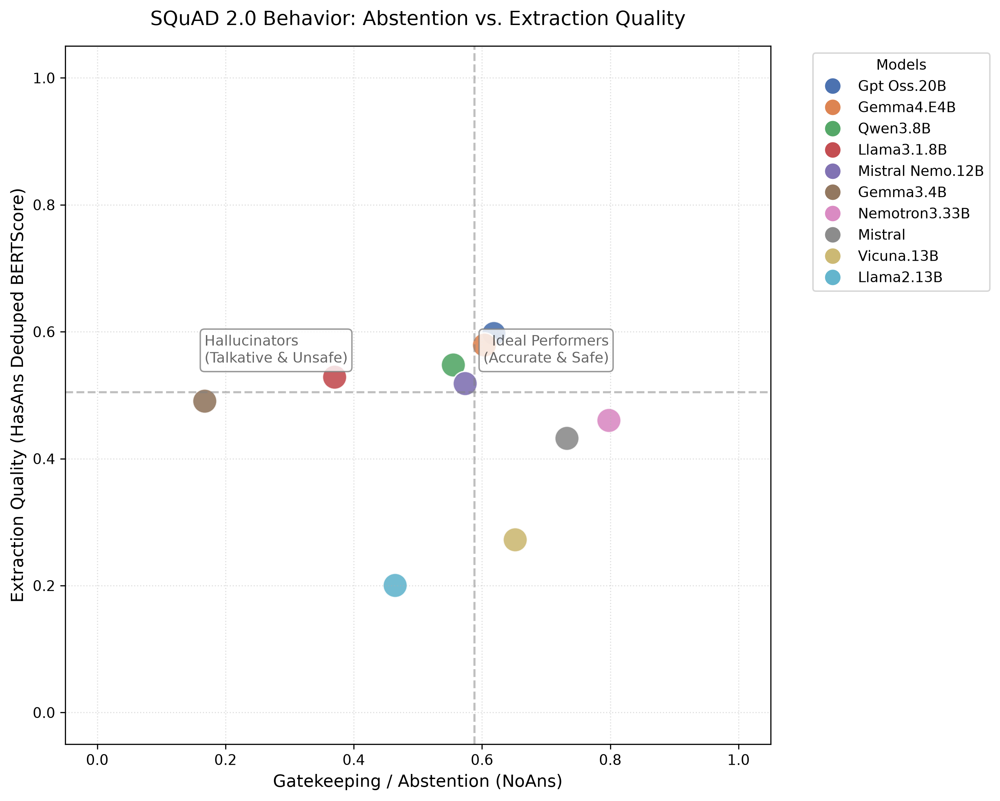
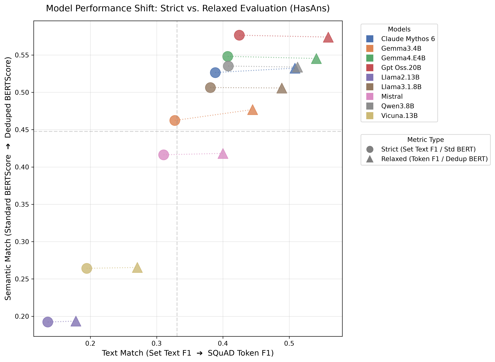
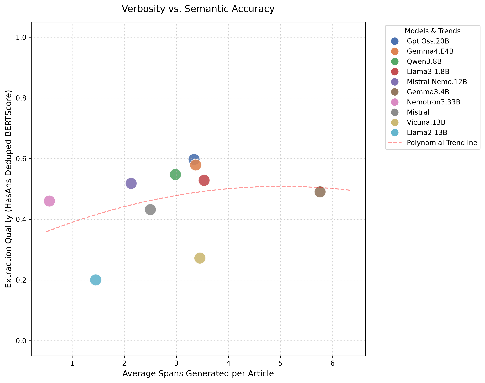
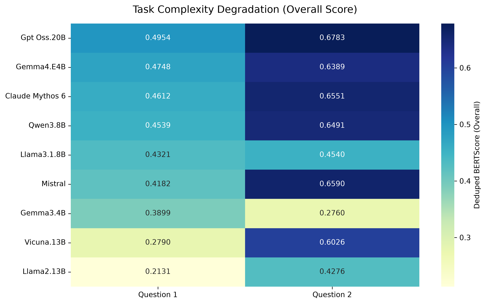
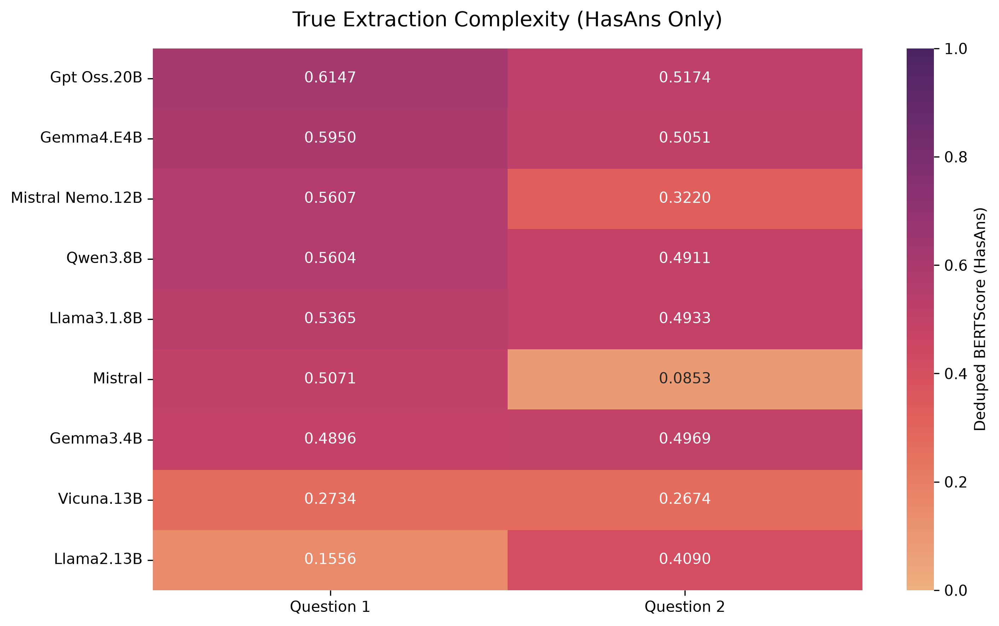
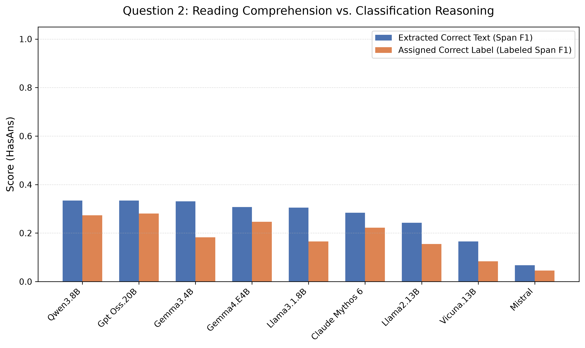

# LLM Evaluation Report
**Pipeline Execution Time:** 533.07 seconds
**Total Models Evaluated:** 9
**Total Documents Processed:** 1574

## Part 1: Global Benchmark Leaderboard (SQuAD 2.0 Standard)
> *All text metrics formatted as (Overall / HasAns)*

| Model System    |   Total_N |   Abstention (NoAns) | SQuAD EM (Overall / HasAns)   | Label EM (Overall / HasAns)   | SQuAD Token F1 (Overall / HasAns)   | Standard BERTScore (Overall / HasAns)   | Deduped BERTScore (Overall / HasAns)   |
|:----------------|----------:|---------------------:|:------------------------------|:------------------------------|:------------------------------------|:----------------------------------------|:---------------------------------------|
| Gpt Oss.20B     |      1574 |                 0.57 | 0.48 / 0.42                   | 0.48 / 0.41                   | 0.56 / 0.56                         | 0.57 / 0.58                             | 0.57 / 0.57                            |
| Gemma4.E4B      |      1574 |                 0.54 | 0.46 / 0.41                   | 0.45 / 0.39                   | 0.54 / 0.54                         | 0.54 / 0.55                             | 0.54 / 0.55                            |
| Claude Mythos 6 |      1574 |                 0.55 | 0.46 / 0.39                   | 0.45 / 0.38                   | 0.53 / 0.51                         | 0.54 / 0.53                             | 0.54 / 0.53                            |
| Qwen3.8B        |      1574 |                 0.54 | 0.46 / 0.41                   | 0.45 / 0.40                   | 0.52 / 0.51                         | 0.54 / 0.54                             | 0.53 / 0.53                            |
| Mistral         |      1574 |                 0.66 | 0.45 / 0.31                   | 0.45 / 0.31                   | 0.51 / 0.40                         | 0.52 / 0.42                             | 0.52 / 0.42                            |
| Llama3.1.8B     |      1574 |                 0.35 | 0.37 / 0.38                   | 0.35 / 0.35                   | 0.43 / 0.49                         | 0.44 / 0.51                             | 0.44 / 0.51                            |
| Vicuna.13B      |      1574 |                 0.63 | 0.37 / 0.19                   | 0.36 / 0.18                   | 0.42 / 0.27                         | 0.41 / 0.26                             | 0.41 / 0.27                            |
| Gemma3.4B       |      1574 |                 0.15 | 0.25 / 0.33                   | 0.24 / 0.30                   | 0.32 / 0.44                         | 0.33 / 0.46                             | 0.34 / 0.48                            |
| Llama2.13B      |      1574 |                 0.46 | 0.27 / 0.14                   | 0.26 / 0.12                   | 0.29 / 0.18                         | 0.30 / 0.19                             | 0.30 / 0.19                            |

## Part 2: Visual Insights

### 1. Abstention vs. Extraction Quality
> *Evaluates whether models are 'Ideal Performers' (safe and accurate) or 'Hallucinators' (talkative but unsafe).*

### 2. Strict vs. Relaxed Evaluation Shift
> *Visualizing the performance penalty models take when evaluated strictly (Exact Match) vs. relaxed (Token/Semantic).*

### 3. Verbosity vs. Semantic Accuracy
> *Tracking whether models artificially inflate their extraction scores by over-generating spans.*

---

## Part 3: Task Complexity Breakdown

### Performance Degradation Heatmaps
> *Overall Score (includes easy abstentions) vs. HasAns Score (true extraction capability).*

### Question 2: The Classification Penalty
> *Visualizing the gap between a model's ability to find the correct text vs. its ability to map it to the correct category.*

### Question 1 Leaderboard
| Model System    |   Total_N |   Abstention (NoAns) | SQuAD EM (Overall / HasAns)   | Label EM (Overall / HasAns)   | SQuAD Token F1 (Overall / HasAns)   | Standard BERTScore (Overall / HasAns)   | Deduped BERTScore (Overall / HasAns)   |
|:----------------|----------:|---------------------:|:------------------------------|:------------------------------|:------------------------------------|:----------------------------------------|:---------------------------------------|
| Gpt Oss.20B     |       923 |                 0.02 | 0.36 / 0.45                   | 0.36 / 0.45                   | 0.48 / 0.59                         | 0.50 / 0.62                             | 0.50 / 0.61                            |
| Gemma4.E4B      |       923 |                 0.02 | 0.35 / 0.43                   | 0.35 / 0.43                   | 0.46 / 0.58                         | 0.48 / 0.59                             | 0.47 / 0.59                            |
| Claude Mythos 6 |       923 |                 0.02 | 0.34 / 0.42                   | 0.34 / 0.42                   | 0.44 / 0.54                         | 0.46 / 0.56                             | 0.46 / 0.57                            |
| Qwen3.8B        |       923 |                 0.03 | 0.35 / 0.43                   | 0.35 / 0.43                   | 0.43 / 0.52                         | 0.46 / 0.56                             | 0.45 / 0.56                            |
| Llama3.1.8B     |       923 |                 0.02 | 0.33 / 0.40                   | 0.33 / 0.40                   | 0.41 / 0.51                         | 0.43 / 0.54                             | 0.43 / 0.53                            |
| Mistral         |       923 |                 0.06 | 0.31 / 0.37                   | 0.31 / 0.37                   | 0.40 / 0.48                         | 0.42 / 0.50                             | 0.42 / 0.51                            |
| Gemma3.4B       |       923 |                 0.01 | 0.26 / 0.33                   | 0.26 / 0.33                   | 0.36 / 0.45                         | 0.38 / 0.47                             | 0.39 / 0.49                            |
| Vicuna.13B      |       923 |                 0.3  | 0.22 / 0.20                   | 0.22 / 0.20                   | 0.28 / 0.28                         | 0.28 / 0.27                             | 0.28 / 0.27                            |
| Llama2.13B      |       923 |                 0.44 | 0.17 / 0.11                   | 0.17 / 0.11                   | 0.20 / 0.14                         | 0.21 / 0.16                             | 0.21 / 0.16                            |

### Question 2 Leaderboard
| Model System    |   Total_N |   Abstention (NoAns) | SQuAD EM (Overall / HasAns)   | Label EM (Overall / HasAns)   | SQuAD Token F1 (Overall / HasAns)   | Standard BERTScore (Overall / HasAns)   | Deduped BERTScore (Overall / HasAns)   |
|:----------------|----------:|---------------------:|:------------------------------|:------------------------------|:------------------------------------|:----------------------------------------|:---------------------------------------|
| Gpt Oss.20B     |       651 |                 0.78 | 0.65 / 0.33                   | 0.64 / 0.28                   | 0.68 / 0.44                         | 0.68 / 0.42                             | 0.68 / 0.42                            |
| Mistral         |       651 |                 0.9  | 0.66 / 0.07                   | 0.65 / 0.05                   | 0.66 / 0.07                         | 0.66 / 0.07                             | 0.66 / 0.07                            |
| Claude Mythos 6 |       651 |                 0.77 | 0.63 / 0.28                   | 0.61 / 0.22                   | 0.66 / 0.39                         | 0.65 / 0.38                             | 0.66 / 0.38                            |
| Qwen3.8B        |       651 |                 0.74 | 0.62 / 0.33                   | 0.60 / 0.27                   | 0.66 / 0.47                         | 0.65 / 0.44                             | 0.65 / 0.44                            |
| Gemma4.E4B      |       651 |                 0.75 | 0.62 / 0.31                   | 0.60 / 0.25                   | 0.65 / 0.40                         | 0.64 / 0.38                             | 0.64 / 0.38                            |
| Vicuna.13B      |       651 |                 0.76 | 0.58 / 0.17                   | 0.56 / 0.08                   | 0.61 / 0.24                         | 0.60 / 0.23                             | 0.60 / 0.23                            |
| Llama3.1.8B     |       651 |                 0.48 | 0.43 / 0.31                   | 0.39 / 0.17                   | 0.46 / 0.41                         | 0.45 / 0.39                             | 0.45 / 0.40                            |
| Llama2.13B      |       651 |                 0.47 | 0.40 / 0.24                   | 0.37 / 0.15                   | 0.43 / 0.33                         | 0.43 / 0.33                             | 0.43 / 0.34                            |
| Gemma3.4B       |       651 |                 0.21 | 0.24 / 0.33                   | 0.20 / 0.18                   | 0.28 / 0.44                         | 0.27 / 0.44                             | 0.28 / 0.44                            |

---

