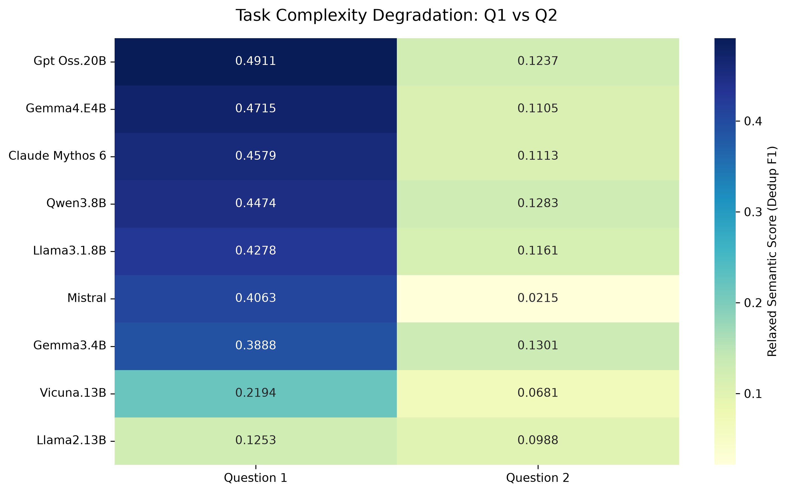

# LLM Evaluation Report
**Pipeline Execution Time:** 531.38 seconds
**Total Models Evaluated:** 9
**Total Documents Processed:** 1574

## Part 1: Global Benchmark Leaderboard
> *Overall system performance aggregated across all tasks.*

| Model System    |   Total_N |   Label EM |   Lexical (EM) |   Token IoU |   Contextual F1 |   Deduped F1 |   Avg Spans |
|:----------------|----------:|-----------:|---------------:|------------:|----------------:|-------------:|------------:|
| Gpt Oss.20B     |      1574 |     0.368  |         0.44   |      0.5472 |          0.3407 |       0.3392 |        3.8  |
| Gemma4.E4B      |      1574 |     0.3677 |         0.4167 |      0.526  |          0.3239 |       0.3222 |        3.82 |
| Qwen3.8B        |      1574 |     0.3633 |         0.4204 |      0.5122 |          0.3162 |       0.3154 |        3.32 |
| Claude Mythos 6 |      1574 |     0.3412 |         0.4103 |      0.5207 |          0.3111 |       0.3145 |        4.79 |
| Llama3.1.8B     |      1574 |     0.3185 |         0.3257 |      0.4208 |          0.2992 |       0.2989 |        3.86 |
| Gemma3.4B       |      1574 |     0.2337 |         0.2105 |      0.322  |          0.2732 |       0.2818 |        6.31 |
| Mistral         |      1574 |     0.3302 |         0.422  |      0.5    |          0.246  |       0.2471 |        2.82 |
| Vicuna.13B      |      1574 |     0.1557 |         0.3514 |      0.4084 |          0.1561 |       0.1568 |        3.83 |
| Llama2.13B      |      1574 |     0.108  |         0.2525 |      0.2887 |          0.1136 |       0.1144 |        1.5  |

## Part 2: Visual Insights

### 1. Strict vs. Relaxed Evaluation Shift
> *Models shifting right demonstrate strong exact-word retrieval. Models shifting up demonstrate strong contextual understanding, even if phrasing differs from the ground truth.*

### 2. Verbosity vs. Semantic Accuracy
> *Tracking whether models artificially inflate their semantic coverage by over-generating spans.*

---

## Part 3: Task Complexity Breakdown

### Performance Degradation Heatmap
> *Visualizing how well models maintain accuracy as the task shifts from simple extraction to complex classification.*

### Question 1 Leaderboard
| Model System    |   Total_N |   Label EM |   Lexical (EM) |   Token IoU |   Contextual F1 |   Deduped F1 |   Avg Spans |
|:----------------|----------:|-----------:|---------------:|------------:|----------------:|-------------:|------------:|
| Gpt Oss.20B     |       923 |     0.3791 |         0.2965 |      0.4552 |          0.494  |       0.4911 |        5.93 |
| Gemma4.E4B      |       923 |     0.3823 |         0.2805 |      0.4461 |          0.4736 |       0.4715 |        6.07 |
| Claude Mythos 6 |       923 |     0.3541 |         0.2647 |      0.4285 |          0.4524 |       0.4579 |        7.58 |
| Qwen3.8B        |       923 |     0.383  |         0.2897 |      0.4149 |          0.449  |       0.4474 |        4.93 |
| Llama3.1.8B     |       923 |     0.358  |         0.2642 |      0.3978 |          0.4291 |       0.4278 |        5.51 |
| Mistral         |       923 |     0.3506 |         0.257  |      0.3882 |          0.4043 |       0.4063 |        4.65 |
| Gemma3.4B       |       923 |     0.2607 |         0.1982 |      0.358  |          0.3756 |       0.3888 |        9.07 |
| Vicuna.13B      |       923 |     0.1637 |         0.1923 |      0.2729 |          0.2184 |       0.2194 |        6.02 |
| Llama2.13B      |       923 |     0.1078 |         0.1566 |      0.1942 |          0.1246 |       0.1253 |        1.67 |

### Question 2 Leaderboard
| Model System    |   Total_N |   Label EM |   Lexical (EM) |   Token IoU |   Contextual F1 |   Deduped F1 |   Avg Spans |
|:----------------|----------:|-----------:|---------------:|------------:|----------------:|-------------:|------------:|
| Gemma3.4B       |       651 |     0.082  |         0.2279 |      0.2711 |          0.1278 |       0.1301 |        2.4  |
| Qwen3.8B        |       651 |     0.2293 |         0.6058 |      0.6502 |          0.1279 |       0.1283 |        1.03 |
| Gpt Oss.20B     |       651 |     0.2665 |         0.6434 |      0.6777 |          0.1232 |       0.1237 |        0.77 |
| Llama3.1.8B     |       651 |     0.0989 |         0.413  |      0.4533 |          0.1151 |       0.1161 |        1.53 |
| Claude Mythos 6 |       651 |     0.206  |         0.6167 |      0.6515 |          0.1107 |       0.1113 |        0.83 |
| Gemma4.E4B      |       651 |     0.2174 |         0.6099 |      0.6392 |          0.1117 |       0.1105 |        0.65 |
| Llama2.13B      |       651 |     0.1086 |         0.3884 |      0.4227 |          0.098  |       0.0988 |        1.26 |
| Vicuna.13B      |       651 |     0.0776 |         0.5771 |      0.6005 |          0.0677 |       0.0681 |        0.71 |
| Mistral         |       651 |     0.0589 |         0.6558 |      0.6585 |          0.0215 |       0.0215 |        0.23 |

---

## Part 4: Error Analysis & Edge Cases
> *Automated extraction of specific failure modes across the pipeline.*

### 🔍 Analysis: Question 1

#### A. Valid Paraphrasing (High Semantic Match, Zero Exact Match)
**Edge Case #1 (Qwen3.8B)**
* **Ground Truth:** `air raid`
* **Model Prediction:** `Air Attack | air attack`
* **Scores:** Exact Match = 0.0000 | Semantic F1 = 0.7013
---
**Edge Case #2 (Mistral)**
* **Ground Truth:** `gun`
* **Model Prediction:** `guns`
* **Scores:** Exact Match = 0.0000 | Semantic F1 = 0.7508
---
**Edge Case #3 (Vicuna.13B)**
* **Ground Truth:** `bullets`
* **Model Prediction:** `bullet`
* **Scores:** Exact Match = 0.0000 | Semantic F1 = 0.7694
---

#### B. Over-Extraction (High Verbosity, Low Precision)
**Edge Case #1 (Qwen3.8B)**
* **Ground Truth:** `[NO TARGET SPANS EXIST]`
* **Model Prediction:** `military equipment | offensive | offensive | fighting | fighting | fighting | fighting | troops | troops | separatist forces | Separatist forces`
* **Scores:** Spans Generated = 11 | Semantic F1 = 0.0000
---
**Edge Case #2 (Qwen3.8B)**
* **Ground Truth:** `air raids | bombed`
* **Model Prediction:** `air raids | air raids | clashes | clashes | clashes | coalition jets | Armoured vehicles | troop carriers`
* **Scores:** Spans Generated = 8 | Semantic F1 = 0.3932
---
**Edge Case #3 (Qwen3.8B)**
* **Ground Truth:** `artillery fire`
* **Model Prediction:** `rockets | IED | IED | ied | mortars | mortars | mortars | artillery | artillery | small arms | small arms | ambushes | ambushes | special forces | Special Forces | special forces`
* **Scores:** Spans Generated = 16 | Semantic F1 = 0.0528
---

### 🔍 Analysis: Question 2

#### A. Valid Paraphrasing (High Semantic Match, Zero Exact Match)
**Edge Case #1 (Gpt Oss.20B)**
* **Ground Truth:** `Thermal Power plant`
* **Model Prediction:** `Thermal Power plant area`
* **Scores:** Exact Match = 0.0000 | Semantic F1 = 0.8119
---
**Edge Case #2 (Vicuna.13B)**
* **Ground Truth:** `militant hideout`
* **Model Prediction:** `militants' hideout`
* **Scores:** Exact Match = 0.0000 | Semantic F1 = 0.7191
---
**Edge Case #3 (Vicuna.13B)**
* **Ground Truth:** `Shalf Castle`
* **Model Prediction:** `Shalf Castle area`
* **Scores:** Exact Match = 0.0000 | Semantic F1 = 0.7379
---

#### B. Over-Extraction (High Verbosity, Low Precision)
**Edge Case #1 (Gpt Oss.20B)**
* **Ground Truth:** `ISIS-held building | house was completely collapsed`
* **Model Prediction:** `house | house | house | house | house`
* **Scores:** Spans Generated = 5 | Semantic F1 = 0.1196
---
**Edge Case #2 (Gpt Oss.20B)**
* **Ground Truth:** `[NO TARGET SPANS EXIST]`
* **Model Prediction:** `landmine | landmine | landmine | ied | IED | vehicle`
* **Scores:** Spans Generated = 6 | Semantic F1 = 0.0000
---
**Edge Case #3 (Gpt Oss.20B)**
* **Ground Truth:** `[NO TARGET SPANS EXIST]`
* **Model Prediction:** `air base | helicopter | aircraft | aircraft | aircraft | fuel reserves`
* **Scores:** Spans Generated = 6 | Semantic F1 = 0.0000
---

#### C. Label Mismatch (Correct Text, Wrong Category)
**Edge Case #1 (Gpt Oss.20B)**
* **Extracted Text:** `wine store` == `wine store`
* **Target Label:** `['Transportation/Marketing']`
* **Predicted Label:** `['Other']`
---
**Edge Case #2 (Gpt Oss.20B)**
* **Extracted Text:** `home` == `home`
* **Target Label:** `['Other']`
* **Predicted Label:** `['Health']`
---
**Edge Case #3 (Gpt Oss.20B)**
* **Extracted Text:** `school | school` == `school | school`
* **Target Label:** `['Other'] | ['Other']`
* **Predicted Label:** `['Government/Rebel'] | ['Government/Rebel']`
---
