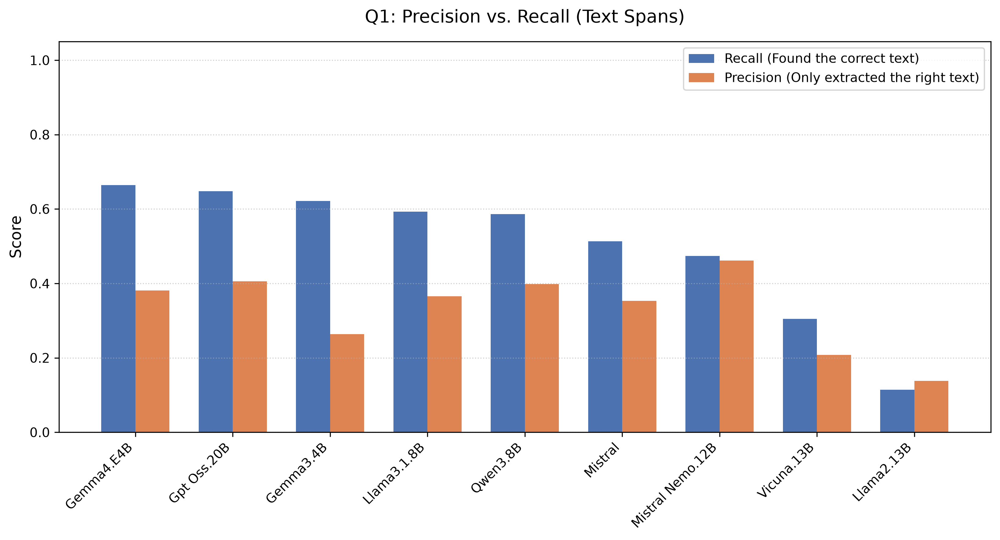
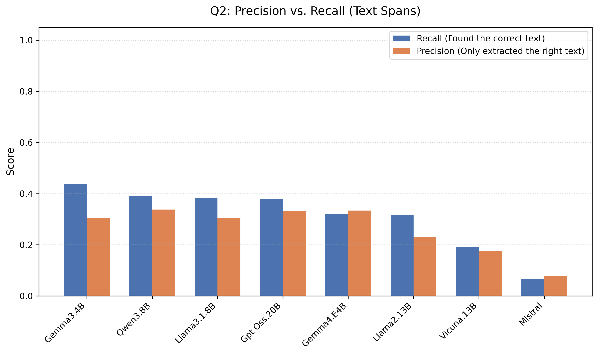
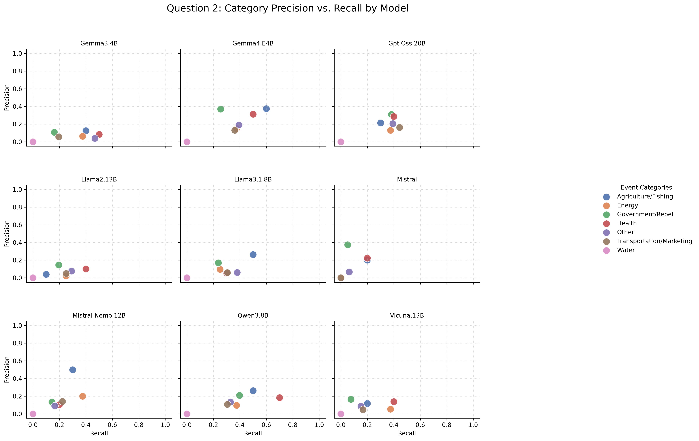

# LLM Evaluation Report
**Total Models Evaluated:** 8
**Total Documents Processed:** 1574

## Part 1: Global Benchmark Leaderboard (SQuAD 2.0 Standard)
> *All text metrics formatted as (Overall / HasAns)*

| Model       |   Doc Count |   Avg Spans |   Abstention (NoAns) |   Missed Answer Rate | Span F1 (Overall / HasAns)   | Labeled Span F1 (Overall / HasAns)   | SQuAD Token F1 (Overall / HasAns)   | BERTScore (Overall / HasAns)   | Deduped BERTScore (Overall / HasAns)   |
|:------------|------------:|------------:|---------------------:|---------------------:|:-----------------------------|:-------------------------------------|:------------------------------------|:-------------------------------|:---------------------------------------|
| Gpt Oss.20B |        1574 |        3.8  |                 0.57 |                 0.07 | 0.48 / 0.42                  | 0.48 / 0.41                          | 0.56 / 0.56                         | 0.57 / 0.58                    | 0.57 / 0.57                            |
| Gemma4.E4B  |        1574 |        3.82 |                 0.54 |                 0.06 | 0.46 / 0.41                  | 0.45 / 0.39                          | 0.54 / 0.54                         | 0.54 / 0.55                    | 0.54 / 0.55                            |
| Qwen3.8B    |        1574 |        3.32 |                 0.54 |                 0.07 | 0.46 / 0.41                  | 0.45 / 0.40                          | 0.52 / 0.51                         | 0.54 / 0.54                    | 0.53 / 0.53                            |
| Llama3.1.8B |        1574 |        3.86 |                 0.35 |                 0.04 | 0.37 / 0.38                  | 0.35 / 0.35                          | 0.43 / 0.49                         | 0.44 / 0.51                    | 0.44 / 0.51                            |
| Gemma3.4B   |        1574 |        6.31 |                 0.15 |                 0.02 | 0.25 / 0.33                  | 0.24 / 0.30                          | 0.32 / 0.44                         | 0.33 / 0.46                    | 0.34 / 0.48                            |
| Mistral     |        1574 |        2.82 |                 0.66 |                 0.19 | 0.45 / 0.31                  | 0.45 / 0.31                          | 0.51 / 0.40                         | 0.52 / 0.42                    | 0.52 / 0.42                            |
| Vicuna.13B  |        1574 |        3.83 |                 0.63 |                 0.27 | 0.37 / 0.19                  | 0.36 / 0.18                          | 0.42 / 0.27                         | 0.41 / 0.26                    | 0.41 / 0.27                            |
| Llama2.13B  |        1574 |        1.5  |                 0.46 |                 0.45 | 0.27 / 0.14                  | 0.26 / 0.12                          | 0.29 / 0.18                         | 0.30 / 0.19                    | 0.30 / 0.19                            |

## Part 2: Visual Insights

### 1. Abstention vs. Extraction Quality
> *Evaluates whether models are 'Ideal Performers' (safe and accurate) or 'Hallucinators' (talkative but unsafe).*

### 2. Strict vs. Relaxed Evaluation Shift
> *Visualizing the performance penalty models take when evaluated strictly (Span F1) vs. relaxed (Token/Semantic).*

### 3. Verbosity vs. Semantic Accuracy
> *Tracking whether models artificially inflate their extraction scores by over-generating spans.*

---

## Part 3: Task Complexity Breakdown

### Performance Degradation Heatmaps
> *Overall Score (includes easy abstentions) vs. HasAns Score (true extraction capability).*

### Question 1 Leaderboard
| Model       |   Doc Count |   Avg Spans |   Abstention (NoAns) |   Missed Answer Rate | Span F1 (Overall / HasAns)   | Labeled Span F1 (Overall / HasAns)   | SQuAD Token F1 (Overall / HasAns)   | BERTScore (Overall / HasAns)   | Deduped BERTScore (Overall / HasAns)   |
|:------------|------------:|------------:|---------------------:|---------------------:|:-----------------------------|:-------------------------------------|:------------------------------------|:-------------------------------|:---------------------------------------|
| Gpt Oss.20B |         923 |        5.93 |                 0.02 |                 0    | 0.36 / 0.45                  | 0.36 / 0.45                          | 0.48 / 0.59                         | 0.50 / 0.62                    | 0.50 / 0.61                            |
| Gemma4.E4B  |         923 |        6.07 |                 0.02 |                 0    | 0.35 / 0.43                  | 0.35 / 0.43                          | 0.46 / 0.58                         | 0.48 / 0.59                    | 0.47 / 0.59                            |
| Qwen3.8B    |         923 |        4.93 |                 0.03 |                 0.03 | 0.35 / 0.43                  | 0.35 / 0.43                          | 0.43 / 0.52                         | 0.46 / 0.56                    | 0.45 / 0.56                            |
| Llama3.1.8B |         923 |        5.51 |                 0.02 |                 0.01 | 0.33 / 0.40                  | 0.33 / 0.40                          | 0.41 / 0.51                         | 0.43 / 0.54                    | 0.43 / 0.53                            |
| Mistral     |         923 |        4.65 |                 0.06 |                 0.03 | 0.31 / 0.37                  | 0.31 / 0.37                          | 0.40 / 0.48                         | 0.42 / 0.50                    | 0.42 / 0.51                            |
| Gemma3.4B   |         923 |        9.07 |                 0.01 |                 0.01 | 0.26 / 0.33                  | 0.26 / 0.33                          | 0.36 / 0.45                         | 0.38 / 0.47                    | 0.39 / 0.49                            |
| Vicuna.13B  |         923 |        6.02 |                 0.3  |                 0.21 | 0.22 / 0.20                  | 0.22 / 0.20                          | 0.28 / 0.28                         | 0.28 / 0.27                    | 0.28 / 0.27                            |
| Llama2.13B  |         923 |        1.67 |                 0.44 |                 0.5  | 0.17 / 0.11                  | 0.17 / 0.11                          | 0.20 / 0.14                         | 0.21 / 0.16                    | 0.21 / 0.16                            |

#### Plot A: Text Extraction Precision & Recall (Q1)
> *This isolates reading comprehension: Did the model locate the correct phrases? HasAns-only bars at exact span match — one operating point per model.*

### Question 2 Leaderboard
| Model       |   Doc Count |   Avg Spans |   Abstention (NoAns) |   Missed Answer Rate | Span F1 (Overall / HasAns)   | Labeled Span F1 (Overall / HasAns)   | SQuAD Token F1 (Overall / HasAns)   | BERTScore (Overall / HasAns)   | Deduped BERTScore (Overall / HasAns)   |
|:------------|------------:|------------:|---------------------:|---------------------:|:-----------------------------|:-------------------------------------|:------------------------------------|:-------------------------------|:---------------------------------------|
| Gemma3.4B   |         651 |        2.4  |                 0.21 |                 0.07 | 0.24 / 0.33                  | 0.20 / 0.18                          | 0.28 / 0.44                         | 0.27 / 0.44                    | 0.28 / 0.44                            |
| Qwen3.8B    |         651 |        1.03 |                 0.74 |                 0.19 | 0.62 / 0.33                  | 0.60 / 0.27                          | 0.66 / 0.47                         | 0.65 / 0.44                    | 0.65 / 0.44                            |
| Gpt Oss.20B |         651 |        0.77 |                 0.78 |                 0.3  | 0.65 / 0.33                  | 0.64 / 0.28                          | 0.68 / 0.44                         | 0.68 / 0.42                    | 0.68 / 0.42                            |
| Llama3.1.8B |         651 |        1.53 |                 0.48 |                 0.16 | 0.43 / 0.31                  | 0.39 / 0.17                          | 0.46 / 0.41                         | 0.45 / 0.39                    | 0.45 / 0.40                            |
| Gemma4.E4B  |         651 |        0.65 |                 0.75 |                 0.27 | 0.62 / 0.31                  | 0.60 / 0.25                          | 0.65 / 0.40                         | 0.64 / 0.38                    | 0.64 / 0.38                            |
| Llama2.13B  |         651 |        1.26 |                 0.47 |                 0.3  | 0.40 / 0.24                  | 0.37 / 0.15                          | 0.43 / 0.33                         | 0.43 / 0.33                    | 0.43 / 0.34                            |
| Vicuna.13B  |         651 |        0.71 |                 0.76 |                 0.48 | 0.58 / 0.17                  | 0.56 / 0.08                          | 0.61 / 0.24                         | 0.60 / 0.23                    | 0.60 / 0.23                            |
| Mistral     |         651 |        0.23 |                 0.9  |                 0.83 | 0.66 / 0.07                  | 0.65 / 0.05                          | 0.66 / 0.07                         | 0.66 / 0.07                    | 0.66 / 0.07                            |

#### Plot A: Text Extraction Precision & Recall (Q2)
> *This isolates reading comprehension: Did the model locate the correct phrases? HasAns-only bars at exact span match — one operating point per model.*

#### Plot B: Category Mislabeling Breakdown
> *Macro-averages hide class-level failures. This 8-panel grid isolates which specific event labels models confuse after extracting the text.*

### Question 2: The Classification Penalty
> **Classification Dropoff = set_text_f1 - label_f1**
> *A large gap indicates the model successfully acts as a search engine (finding the correct evidence text) but fails as a classifier (assigning the wrong event label).*

---

---

## Part 4: Error Analysis & SQuAD 2.0 Edge Cases
> *Automated extraction of specific failure modes across the IE pipeline.*

### Analysis: Question 1

#### A. Missed Extractions (Failed to extract an existing answer)
* **Total cases:** 594
* **By model:** Llama2.13B: 366, Vicuna.13B: 157, Qwen3.8B: 25, Mistral: 22, Llama3.1.8B: 11, Gemma3.4B: 5, Gemma4.E4B: 3, Gpt Oss.20B: 3, Claude Mythos 6: 2

**Edge Case #1 (Llama2.13B)**
* **Ground Truth:** `warplanes | warplanes | warplanes | shells | shells | shells | shells | shells | mortar shells | sniper shot | sniper shot | sniper shot | guided missile | bombed | mortars | rocket shelling | aerial bombardment | aerial bombardment | aerial bombardment | aerial bombardment | shelling | shelling | airstrikes | snipers | snipers | snipers | rocket shells | barrel bombs | shelled | shelled | shelled | shelled | shelled | shelled | shelled | shelled | shelled | drone`
* **Model Prediction:** `[ABSTAINED - Predicted Nothing]`
---

**Edge Case #2 (Vicuna.13B)**
* **Ground Truth:** `warplanes | warplanes | warplanes | shells | shells | shells | shells | shells | mortar shells | sniper shot | sniper shot | sniper shot | guided missile | bombed | mortars | rocket shelling | aerial bombardment | aerial bombardment | aerial bombardment | aerial bombardment | shelling | shelling | airstrikes | snipers | snipers | snipers | rocket shells | barrel bombs | shelled | shelled | shelled | shelled | shelled | shelled | shelled | shelled | shelled | drone`
* **Model Prediction:** `[ABSTAINED - Predicted Nothing]`
---

**Edge Case #3 (Llama3.1.8B)**
* **Ground Truth:** `booby trapped vehicle | booby trapped vehicle | shot | shot | improvised explosive devices | opening fire | bombing | bombing`
* **Model Prediction:** `[ABSTAINED - Predicted Nothing]`
---

#### B. Hallucinations (Generated text on an unanswerable article)
* **Total cases:** 1488
* **By model:** Gemma3.4B: 183, Claude Mythos 6: 181, Gemma4.E4B: 181, Gpt Oss.20B: 180, Llama3.1.8B: 180, Qwen3.8B: 178, Mistral: 173, Vicuna.13B: 129, Llama2.13B: 103

**Edge Case #1 (Gemma3.4B)**
* **Ground Truth:** `[EMPTY ARTICLE - Should have abstained]`
* **Model Prediction:** `Officer | Officer | officer | Officer | officer | Sergeant | sergeant | Sergeant | Terrorists | terrorists | terrorists | terrorists | terrorists | armed | armed | Armed | armed | armed | Armed | armed | armed | Armed | armed | armed | armed | armed | armed | armed | Armed | armed | armed | group | group | group | group | group | Group | group | group | Group | group | group | group | group | group | group | group | group | group | machineguns | RPGs | RPGs | RPGs | RPGs | launchers | night vision binoculars | sniper rifles | explosive | explosive | explosive | explosive | remote control | ambulance | ambulance`
* **Spans Generated:** 64
---

**Edge Case #2 (Vicuna.13B)**
* **Ground Truth:** `[EMPTY ARTICLE - Should have abstained]`
* **Model Prediction:** `Iraqi armed forces | Iraqi armed forces | military statement | military statement | military statement | Old City center | three adjacent districts | Tigris river | Desperate civilians | little food and water | no electricity | limited access to hospitals | Iraqi air force | humanitarian groups | safety of those trying to escape | landmark leaning minaret | black flag | next few days | United Nations | deep concern | hundreds of thousands of civilians | behind Islamic State lines | behind Islamic State lines | disturbing reports | children being deliberately targeted by snipers | residents | Residents | Residents | millet | cooked like rice | wild mallow plants | mulberry leaves | operations launched | MOSUL | Mosul | Mosul | Mosul | Mosul | Mosul | surrounding Nineveh province | senior commander | senior commander | Mashregh | Iranian news website | Popular Mobilisation | Syrian army | significant advantage`
* **Spans Generated:** 47
---

**Edge Case #3 (Claude Mythos 6)**
* **Ground Truth:** `[EMPTY ARTICLE - Should have abstained]`
* **Model Prediction:** `killed | killed | killed | killed | captured | captured | offensive | offensive | offensive | offensive | offensive | offensive | killed | killed | killed | killed | arrested | fight | fight | fight | fight | fight | fight | destroy | destroy | destroy | hurled gasoline | torched`
* **Spans Generated:** 28
---

#### C. Over-Extraction (High Verbosity, Low Precision)
* **Total cases:** 955
* **By model:** Gemma3.4B: 218, Vicuna.13B: 176, Claude Mythos 6: 121, Llama3.1.8B: 101, Mistral: 84, Gemma4.E4B: 74, Gpt Oss.20B: 74, Qwen3.8B: 69, Llama2.13B: 38

**Edge Case #1 (Vicuna.13B)**
* **Ground Truth:** `artillery`
* **Model Prediction:** `forces | forces | forces | forces | forces | forces | forces | forces | forces | troops | troops | troops | troops | troops | push | push | offensive | offensive | offensive | campaign | endurance | fighting heroes | return | arms of the motherland | surrender | Insurgency bastion | Sunni tribal volunteers | strikes | town of Albu Kamal | Syrian side of the border | Syrian side of the border | stronghold in the north | launch | launch | launch | launch | autonomous Kurdish region | autonomous Kurdish region | finances | crippling blow | territory | territory | territory | territory | territory | September 25 independence referendum | Iraqi prime minister | dismiss | annulment of the referendum | respect for the constitution | allies | Iran | Iran | Iran | Tehran | backing | military successes`
* **Scores:** Spans Generated = 57 | Deduped BERTScore = 0.0000
---

**Edge Case #2 (Gemma3.4B)**
* **Ground Truth:** `airstrikes`
* **Model Prediction:** `UN | un | UN | UN | un | un | un | UN | UN | un | peace plan | peace plan | peace plan | heavy weapons | airstrikes | militant activity | forces | Forces | forces | forces | forces | forces | forces | Forces | forces | forces | forces | coalition | coalition | coalition | coalition | engineering college | port city | military | operation | operation | operation | fighters | soldiers`
* **Scores:** Spans Generated = 39 | Deduped BERTScore = 0.0000
---

**Edge Case #3 (Gemma4.E4B)**
* **Ground Truth:** `shell`
* **Model Prediction:** `ballistic missiles | artillery | clash | clash | clash | clash | clash | Clash | clash | troops | troops | troops | troops | troops | troops | militant activity`
* **Scores:** Spans Generated = 16 | Deduped BERTScore = 0.0000
---

#### D. Valid Paraphrasing (High Semantic Match, Zero Exact Match)
* **Total cases:** 3
* **By model:** Mistral: 1, Qwen3.8B: 1, Vicuna.13B: 1

**Edge Case #1 (Mistral)**
* **Ground Truth:** `gun`
* **Model Prediction:** `guns`
* **Scores:** Span F1 = 0.0000 | Deduped BERTScore = 0.7508
---

**Edge Case #2 (Qwen3.8B)**
* **Ground Truth:** `air raid`
* **Model Prediction:** `Air Attack | air attack`
* **Scores:** Span F1 = 0.0000 | Deduped BERTScore = 0.7013
---

**Edge Case #3 (Vicuna.13B)**
* **Ground Truth:** `bullets`
* **Model Prediction:** `bullet`
* **Scores:** Span F1 = 0.0000 | Deduped BERTScore = 0.7694
---

### Analysis: Question 2

#### A. Missed Extractions (Failed to extract an existing answer)
* **Total cases:** 561
* **By model:** Mistral: 159, Vicuna.13B: 91, Claude Mythos 6: 65, Gpt Oss.20B: 58, Llama2.13B: 57, Gemma4.E4B: 52, Qwen3.8B: 36, Llama3.1.8B: 30, Gemma3.4B: 13

**Edge Case #1 (Gemma4.E4B)**
* **Ground Truth:** `weapons storage areas | oil storage tanks | ISIS headquarters | ISIS-held buildings | ISIS-held buildings | bridge | bridge | weapons storage area | ISIS fueling station | tunnels | oil refinement stills | VBIED storage facility`
* **Model Prediction:** `[ABSTAINED - Predicted Nothing]`
---

**Edge Case #2 (Llama2.13B)**
* **Ground Truth:** `weapons storage areas | oil storage tanks | ISIS headquarters | ISIS-held buildings | ISIS-held buildings | bridge | bridge | weapons storage area | ISIS fueling station | tunnels | oil refinement stills | VBIED storage facility`
* **Model Prediction:** `[ABSTAINED - Predicted Nothing]`
---

**Edge Case #3 (Llama3.1.8B)**
* **Ground Truth:** `weapons storage areas | oil storage tanks | ISIS headquarters | ISIS-held buildings | ISIS-held buildings | bridge | bridge | weapons storage area | ISIS fueling station | tunnels | oil refinement stills | VBIED storage facility`
* **Model Prediction:** `[ABSTAINED - Predicted Nothing]`
---

#### B. Hallucinations (Generated text on an unanswerable article)
* **Total cases:** 1450
* **By model:** Gemma3.4B: 365, Llama2.13B: 246, Llama3.1.8B: 240, Qwen3.8B: 121, Gemma4.E4B: 116, Vicuna.13B: 112, Claude Mythos 6: 106, Gpt Oss.20B: 99, Mistral: 45

**Edge Case #1 (Llama3.1.8B)**
* **Ground Truth:** `[EMPTY ARTICLE - Should have abstained]`
* **Model Prediction:** `areas | areas | areas | areas | areas | areas | areas | areas | areas | areas | areas | areas | areas | areas | areas | areas | areas | areas | areas | areas | areas | Douma city | Zamalka city | Zamalka city | Ein Tarma town | AlMotahalik AlJanobi (the Southern Bypass)`
* **Spans Generated:** 26
---

**Edge Case #2 (Gpt Oss.20B)**
* **Ground Truth:** `[EMPTY ARTICLE - Should have abstained]`
* **Model Prediction:** `Morek | Morek | Morek | Morek | M’aarkaba | Lahaya | Lahaya | Lahaya | Kabani | Kabani | Atshan | Atshan | Om Jalal`
* **Spans Generated:** 13
---

**Edge Case #3 (Qwen3.8B)**
* **Ground Truth:** `[EMPTY ARTICLE - Should have abstained]`
* **Model Prediction:** `regime forces | regime forces | regime forces | regime forces | regime forces | regime forces | regime forces | regime forces | regime forces | regime forces | regime forces | regime forces`
* **Spans Generated:** 12
---

#### C. Over-Extraction (High Verbosity, Low Precision)
* **Total cases:** 64
* **By model:** Gemma3.4B: 21, Llama3.1.8B: 11, Claude Mythos 6: 9, Qwen3.8B: 7, Llama2.13B: 5, Vicuna.13B: 5, Mistral: 3, Gpt Oss.20B: 2, Gemma4.E4B: 1

**Edge Case #1 (Gemma3.4B)**
* **Ground Truth:** `neighborhoods`
* **Model Prediction:** `warplanes | warplanes | missile | missile | shelling | shelling | shelling | shelling | shelling | shelling`
* **Scores:** Spans Generated = 10 | Deduped BERTScore = 0.0000
---

**Edge Case #2 (Llama2.13B)**
* **Ground Truth:** `olive plantations`
* **Model Prediction:** `checkpoint | Military Council | Military Council | Military Council | Military Council | Military Council | Military Council | Military Council`
* **Scores:** Spans Generated = 8 | Deduped BERTScore = 0.0000
---

**Edge Case #3 (Gpt Oss.20B)**
* **Ground Truth:** `buildings`
* **Model Prediction:** `navy ship | navy ship | port | port | port | port | headquarters`
* **Scores:** Spans Generated = 7 | Deduped BERTScore = 0.0000
---

#### D. Valid Paraphrasing (High Semantic Match, Zero Exact Match)
* **Total cases:** 7
* **By model:** Claude Mythos 6: 2, Vicuna.13B: 2, Gemma3.4B: 1, Gpt Oss.20B: 1, Llama2.13B: 1

**Edge Case #1 (Claude Mythos 6)**
* **Ground Truth:** `Thermal Power plant`
* **Model Prediction:** `Thermal Power plant area`
* **Scores:** Span F1 = 0.0000 | Deduped BERTScore = 0.8119
---

**Edge Case #2 (Gpt Oss.20B)**
* **Ground Truth:** `Thermal Power plant`
* **Model Prediction:** `Thermal Power plant area`
* **Scores:** Span F1 = 0.0000 | Deduped BERTScore = 0.8119
---

**Edge Case #3 (Llama2.13B)**
* **Ground Truth:** `Shalf Castle`
* **Model Prediction:** `Shalf Castle area`
* **Scores:** Span F1 = 0.0000 | Deduped BERTScore = 0.7379
---

#### E. Label Mismatch (High Text Match, Wrong Category)
* **Total cases:** 51
* **By model:** Gemma3.4B: 11, Llama3.1.8B: 9, Vicuna.13B: 6, Claude Mythos 6: 5, Gemma4.E4B: 5, Gpt Oss.20B: 5, Llama2.13B: 5, Qwen3.8B: 3, Mistral: 2

**Edge Case #1 (Claude Mythos 6)**
* **Extracted Text:** `wine store` == `wine store`
* **Target Label:** `['Transportation/Marketing']`
* **Predicted Label:** `['Other']`
* **Scores:** Span F1 = 1.0000 | Labeled Span F1 = 0.0000
---

**Edge Case #2 (Gemma3.4B)**
* **Extracted Text:** `wells` == `wells`
* **Target Label:** `['Water']`
* **Predicted Label:** `['Energy']`
* **Scores:** Span F1 = 1.0000 | Labeled Span F1 = 0.0000
---

**Edge Case #3 (Gemma4.E4B)**
* **Extracted Text:** `wine store` == `wine store`
* **Target Label:** `['Transportation/Marketing']`
* **Predicted Label:** `['Other']`
* **Scores:** Span F1 = 1.0000 | Labeled Span F1 = 0.0000
---

