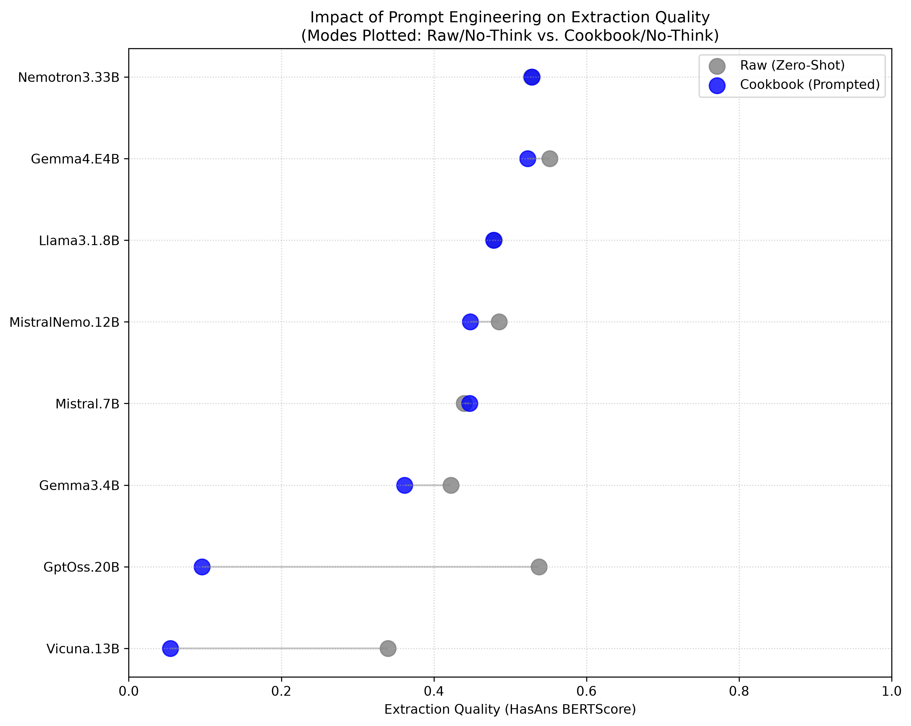
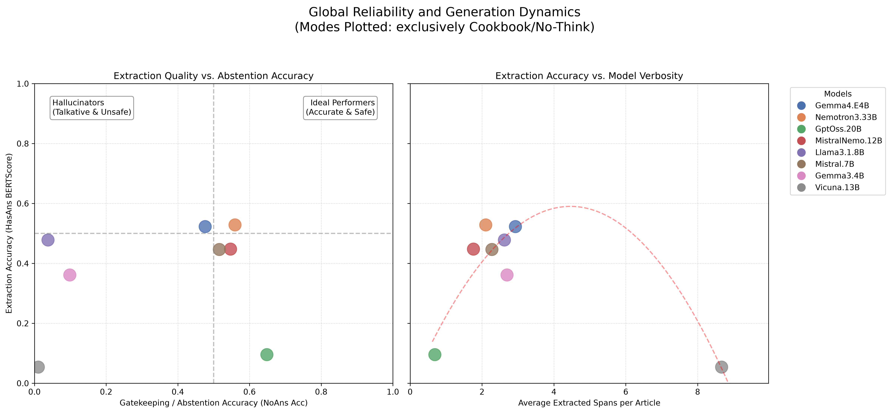
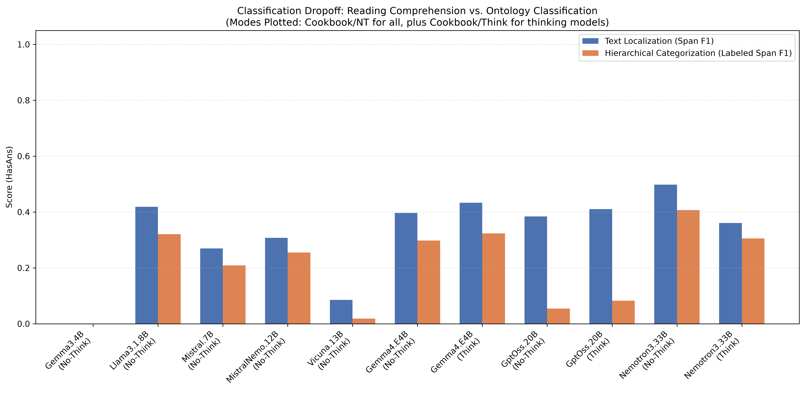
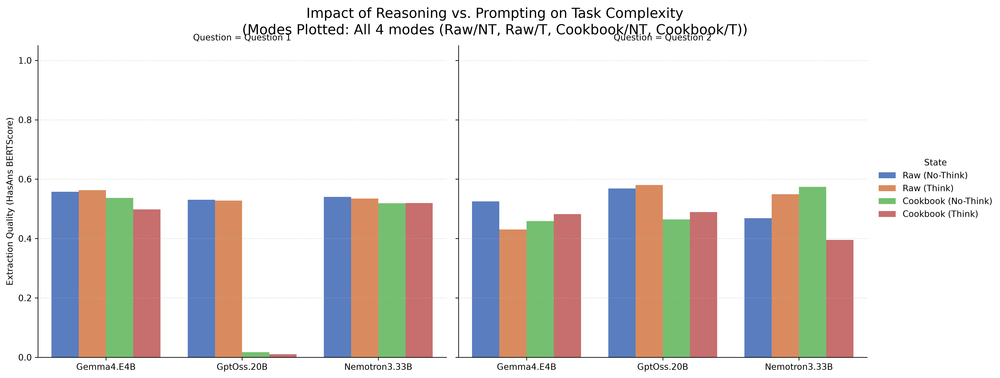

# LLM Evaluation Report
**Total Models Evaluated:** 8
**Total Documents Processed:** 1860
**Full Evaluation Compute Time:** Unknown seconds

## Part 1: Global Benchmark Leaderboard (SQuAD 2.0 Evaluation)
> *All text metrics formatted as (Overall / HasAns)*

| Model           | Method        |   Doc Count |   Abstention (NoAns) |   Missed Answer Rate | Span F1 (Overall / HasAns)   | Labeled Span F1 (Overall / HasAns)   | SQuAD Token F1 (Overall / HasAns)   | BERTScore (Overall / HasAns)   |
|:----------------|:--------------|------------:|---------------------:|---------------------:|:-----------------------------|:-------------------------------------|:------------------------------------|:-------------------------------|
| Gemma4.E4B      | Raw (T)       |        1860 |                 0.68 |                 0.04 | 0.58 / 0.48                  | 0.57 / 0.46                          | 0.61 / 0.54                         | 0.61 / 0.54                    |
|                 | Raw (NT)      |        1860 |                 0.4  |                 0.01 | 0.44 / 0.49                  | 0.43 / 0.47                          | 0.48 / 0.55                         | 0.48 / 0.55                    |
|                 | Cookbook (T)  |        1860 |                 0.5  |                 0.02 | 0.47 / 0.44                  | 0.46 / 0.42                          | 0.50 / 0.50                         | 0.50 / 0.50                    |
|                 | Cookbook (NT) |        1860 |                 0.48 |                 0.02 | 0.47 / 0.46                  | 0.46 / 0.45                          | 0.50 / 0.52                         | 0.50 / 0.52                    |
| Nemotron3.33B   | Raw (T)       |        1860 |                 0.58 |                 0.01 | 0.52 / 0.45                  | 0.51 / 0.44                          | 0.55 / 0.53                         | 0.56 / 0.54                    |
|                 | Raw (NT)      |        1860 |                 0.38 |                 0.01 | 0.42 / 0.46                  | 0.41 / 0.44                          | 0.45 / 0.53                         | 0.45 / 0.53                    |
|                 | Cookbook (T)  |        1860 |                 0.67 |                 0.02 | 0.55 / 0.43                  | 0.54 / 0.42                          | 0.58 / 0.50                         | 0.58 / 0.50                    |
|                 | Cookbook (NT) |        1860 |                 0.56 |                 0.01 | 0.51 / 0.45                  | 0.50 / 0.44                          | 0.54 / 0.53                         | 0.54 / 0.53                    |
| GptOss.20B      | Raw (T)       |        1860 |                 0.65 |                 0.02 | 0.55 / 0.45                  | 0.55 / 0.45                          | 0.58 / 0.51                         | 0.59 / 0.54                    |
|                 | Raw (NT)      |        1860 |                 0.63 |                 0.01 | 0.54 / 0.45                  | 0.54 / 0.44                          | 0.57 / 0.51                         | 0.58 / 0.54                    |
|                 | Cookbook (T)  |        1860 |                 0.63 |                 0.02 | 0.36 / 0.08                  | 0.33 / 0.02                          | 0.36 / 0.10                         | 0.36 / 0.09                    |
|                 | Cookbook (NT) |        1860 |                 0.65 |                 0.02 | 0.36 / 0.08                  | 0.33 / 0.02                          | 0.38 / 0.10                         | 0.37 / 0.10                    |
| MistralNemo.12B | Raw (NT)      |        1860 |                 0.57 |                 0.04 | 0.50 / 0.43                  | 0.50 / 0.42                          | 0.52 / 0.47                         | 0.53 / 0.49                    |
|                 | Cookbook (NT) |        1860 |                 0.55 |                 0.04 | 0.46 / 0.38                  | 0.46 / 0.37                          | 0.49 / 0.44                         | 0.50 / 0.45                    |
| Llama3.1.8B     | Raw (NT)      |        1860 |                 0.02 |                 0    | 0.21 / 0.39                  | 0.20 / 0.38                          | 0.25 / 0.48                         | 0.25 / 0.48                    |
|                 | Cookbook (NT) |        1860 |                 0.04 |                 0    | 0.21 / 0.39                  | 0.21 / 0.38                          | 0.26 / 0.48                         | 0.26 / 0.48                    |
| Mistral.7B      | Raw (NT)      |        1860 |                 0.55 |                 0.06 | 0.46 / 0.38                  | 0.46 / 0.37                          | 0.49 / 0.43                         | 0.49 / 0.44                    |
|                 | Cookbook (NT) |        1860 |                 0.52 |                 0.04 | 0.45 / 0.38                  | 0.44 / 0.37                          | 0.48 / 0.44                         | 0.48 / 0.45                    |
| Gemma3.4B       | Raw (NT)      |        1860 |                 0.01 |                 0.03 | 0.18 / 0.34                  | 0.17 / 0.33                          | 0.21 / 0.42                         | 0.22 / 0.42                    |
|                 | Cookbook (NT) |        1860 |                 0.1  |                 0.02 | 0.18 / 0.27                  | 0.18 / 0.27                          | 0.21 / 0.33                         | 0.23 / 0.36                    |
| Vicuna.13B      | Raw (NT)      |        1860 |                 0.28 |                 0.03 | 0.28 / 0.29                  | 0.28 / 0.27                          | 0.31 / 0.34                         | 0.31 / 0.34                    |
|                 | Cookbook (NT) |        1860 |                 0.01 |                 0    | 0.03 / 0.04                  | 0.02 / 0.03                          | 0.03 / 0.05                         | 0.03 / 0.05                    |

---

## Part 2: Task Complexity Breakdown

### Question 1 Leaderboard
| Model           | Method        |   Doc Count |   Abstention (NoAns) |   Missed Answer Rate | Span F1 (Overall / HasAns)   | Labeled Span F1 (Overall / HasAns)   | SQuAD Token F1 (Overall / HasAns)   | BERTScore (Overall / HasAns)   |
|:----------------|:--------------|------------:|---------------------:|---------------------:|:-----------------------------|:-------------------------------------|:------------------------------------|:-------------------------------|
| Gemma4.E4B      | Raw (T)       |         954 |                 0.27 |                 0    | 0.45 / 0.50                  | 0.45 / 0.50                          | 0.51 / 0.56                         | 0.50 / 0.56                    |
|                 | Raw (NT)      |         954 |                 0.11 |                 0    | 0.42 / 0.49                  | 0.42 / 0.49                          | 0.47 / 0.56                         | 0.47 / 0.56                    |
|                 | Cookbook (T)  |         954 |                 0.01 |                 0    | 0.36 / 0.44                  | 0.36 / 0.44                          | 0.40 / 0.50                         | 0.40 / 0.50                    |
|                 | Cookbook (NT) |         954 |                 0.1  |                 0    | 0.40 / 0.48                  | 0.40 / 0.48                          | 0.45 / 0.54                         | 0.45 / 0.54                    |
| Nemotron3.33B   | Raw (T)       |         954 |                 0.06 |                 0    | 0.37 / 0.45                  | 0.37 / 0.45                          | 0.43 / 0.52                         | 0.44 / 0.54                    |
|                 | Raw (NT)      |         954 |                 0.01 |                 0    | 0.39 / 0.48                  | 0.39 / 0.48                          | 0.43 / 0.54                         | 0.43 / 0.54                    |
|                 | Cookbook (T)  |         954 |                 0.02 |                 0    | 0.36 / 0.44                  | 0.36 / 0.44                          | 0.42 / 0.52                         | 0.42 / 0.52                    |
|                 | Cookbook (NT) |         954 |                 0.01 |                 0    | 0.36 / 0.44                  | 0.36 / 0.44                          | 0.42 / 0.52                         | 0.42 / 0.52                    |
| GptOss.20B      | Raw (T)       |         954 |                 0.12 |                 0    | 0.38 / 0.44                  | 0.38 / 0.44                          | 0.42 / 0.50                         | 0.45 / 0.53                    |
|                 | Raw (NT)      |         954 |                 0.09 |                 0    | 0.37 / 0.44                  | 0.37 / 0.44                          | 0.41 / 0.49                         | 0.44 / 0.53                    |
|                 | Cookbook (T)  |         954 |                 0    |                 0    | 0.00 / 0.01                  | 0.00 / 0.01                          | 0.01 / 0.01                         | 0.01 / 0.01                    |
|                 | Cookbook (NT) |         954 |                 0    |                 0    | 0.01 / 0.01                  | 0.01 / 0.01                          | 0.01 / 0.01                         | 0.01 / 0.02                    |
| MistralNemo.12B | Raw (NT)      |         954 |                 0.02 |                 0    | 0.36 / 0.45                  | 0.36 / 0.45                          | 0.40 / 0.50                         | 0.41 / 0.51                    |
|                 | Cookbook (NT) |         954 |                 0    |                 0    | 0.31 / 0.39                  | 0.31 / 0.39                          | 0.37 / 0.46                         | 0.37 / 0.47                    |
| Llama3.1.8B     | Raw (NT)      |         954 |                 0    |                 0    | 0.31 / 0.39                  | 0.31 / 0.39                          | 0.39 / 0.48                         | 0.38 / 0.48                    |
|                 | Cookbook (NT) |         954 |                 0.01 |                 0    | 0.31 / 0.39                  | 0.31 / 0.39                          | 0.39 / 0.48                         | 0.38 / 0.48                    |
| Mistral.7B      | Raw (NT)      |         954 |                 0.01 |                 0    | 0.33 / 0.41                  | 0.33 / 0.41                          | 0.37 / 0.46                         | 0.38 / 0.47                    |
|                 | Cookbook (NT) |         954 |                 0    |                 0    | 0.33 / 0.41                  | 0.33 / 0.41                          | 0.37 / 0.47                         | 0.38 / 0.47                    |
| Gemma3.4B       | Raw (NT)      |         954 |                 0.05 |                 0.04 | 0.28 / 0.33                  | 0.28 / 0.33                          | 0.33 / 0.41                         | 0.34 / 0.41                    |
|                 | Cookbook (NT) |         954 |                 0    |                 0    | 0.26 / 0.32                  | 0.26 / 0.32                          | 0.32 / 0.40                         | 0.33 / 0.41                    |
| Vicuna.13B      | Raw (NT)      |         954 |                 0.01 |                 0.01 | 0.24 / 0.29                  | 0.24 / 0.29                          | 0.27 / 0.34                         | 0.28 / 0.34                    |
|                 | Cookbook (NT) |         954 |                 0    |                 0    | 0.02 / 0.03                  | 0.02 / 0.03                          | 0.03 / 0.04                         | 0.03 / 0.04                    |

### Question 2 Leaderboard
| Model           | Method        |   Doc Count |   Abstention (NoAns) |   Missed Answer Rate | Span F1 (Overall / HasAns)   | Labeled Span F1 (Overall / HasAns)   | SQuAD Token F1 (Overall / HasAns)   | BERTScore (Overall / HasAns)   |
|:----------------|:--------------|------------:|---------------------:|---------------------:|:-----------------------------|:-------------------------------------|:------------------------------------|:-------------------------------|
| GptOss.20B      | Raw (T)       |         906 |                 0.79 |                 0.09 | 0.73 / 0.50                  | 0.73 / 0.48                          | 0.75 / 0.58                         | 0.75 / 0.58                    |
|                 | Raw (NT)      |         906 |                 0.77 |                 0.08 | 0.72 / 0.49                  | 0.71 / 0.46                          | 0.73 / 0.58                         | 0.73 / 0.57                    |
|                 | Cookbook (T)  |         906 |                 0.79 |                 0.1  | 0.72 / 0.41                  | 0.67 / 0.08                          | 0.74 / 0.51                         | 0.74 / 0.49                    |
|                 | Cookbook (NT) |         906 |                 0.82 |                 0.12 | 0.74 / 0.38                  | 0.68 / 0.05                          | 0.76 / 0.50                         | 0.75 / 0.46                    |
| Nemotron3.33B   | Raw (T)       |         906 |                 0.71 |                 0.08 | 0.67 / 0.47                  | 0.66 / 0.42                          | 0.68 / 0.56                         | 0.68 / 0.55                    |
|                 | Raw (NT)      |         906 |                 0.47 |                 0.05 | 0.46 / 0.39                  | 0.43 / 0.25                          | 0.48 / 0.48                         | 0.47 / 0.47                    |
|                 | Cookbook (T)  |         906 |                 0.83 |                 0.13 | 0.75 / 0.36                  | 0.74 / 0.31                          | 0.76 / 0.41                         | 0.75 / 0.40                    |
|                 | Cookbook (NT) |         906 |                 0.7  |                 0.07 | 0.67 / 0.50                  | 0.65 / 0.41                          | 0.68 / 0.58                         | 0.68 / 0.57                    |
| Llama3.1.8B     | Raw (NT)      |         906 |                 0.03 |                 0    | 0.10 / 0.42                  | 0.08 / 0.34                          | 0.11 / 0.49                         | 0.11 / 0.49                    |
|                 | Cookbook (NT) |         906 |                 0.05 |                 0.01 | 0.11 / 0.42                  | 0.10 / 0.32                          | 0.12 / 0.48                         | 0.13 / 0.49                    |
| Gemma3.4B       | Raw (NT)      |         906 |                 0    |                 0    | 0.07 / 0.39                  | 0.05 / 0.29                          | 0.09 / 0.46                         | 0.08 / 0.46                    |
|                 | Cookbook (NT) |         906 |                 0.12 |                 0.12 | 0.10 / 0.00                  | 0.10 / 0.00                          | 0.10 / 0.00                         | 0.12 / 0.12                    |
| Gemma4.E4B      | Raw (T)       |         906 |                 0.78 |                 0.23 | 0.71 / 0.39                  | 0.69 / 0.29                          | 0.72 / 0.43                         | 0.72 / 0.43                    |
|                 | Raw (NT)      |         906 |                 0.48 |                 0.04 | 0.47 / 0.46                  | 0.45 / 0.34                          | 0.48 / 0.50                         | 0.49 / 0.53                    |
|                 | Cookbook (T)  |         906 |                 0.63 |                 0.13 | 0.60 / 0.43                  | 0.58 / 0.32                          | 0.61 / 0.48                         | 0.61 / 0.48                    |
|                 | Cookbook (NT) |         906 |                 0.57 |                 0.1  | 0.54 / 0.40                  | 0.52 / 0.30                          | 0.55 / 0.44                         | 0.55 / 0.46                    |
| MistralNemo.12B | Raw (NT)      |         906 |                 0.72 |                 0.25 | 0.65 / 0.32                  | 0.64 / 0.27                          | 0.65 / 0.37                         | 0.65 / 0.36                    |
|                 | Cookbook (NT) |         906 |                 0.69 |                 0.25 | 0.62 / 0.31                  | 0.61 / 0.26                          | 0.63 / 0.36                         | 0.63 / 0.36                    |
| Vicuna.13B      | Raw (NT)      |         906 |                 0.35 |                 0.12 | 0.33 / 0.27                  | 0.32 / 0.18                          | 0.34 / 0.33                         | 0.34 / 0.32                    |
|                 | Cookbook (NT) |         906 |                 0.01 |                 0.01 | 0.03 / 0.09                  | 0.01 / 0.02                          | 0.03 / 0.11                         | 0.03 / 0.12                    |
| Mistral.7B      | Raw (NT)      |         906 |                 0.69 |                 0.35 | 0.61 / 0.25                  | 0.60 / 0.19                          | 0.62 / 0.30                         | 0.62 / 0.30                    |
|                 | Cookbook (NT) |         906 |                 0.65 |                 0.24 | 0.58 / 0.27                  | 0.57 / 0.21                          | 0.59 / 0.33                         | 0.59 / 0.32                    |

---

## Part 3: Graphical Diagnostics

Generating Figure 1: Prompt Engineering Impact...
> This dumbbell plot shows if using prompt engineering (Cookbook) actually improves a model's extraction accuracy compared to its raw baseline.

Generating Figure 2: Hallucination and Verbosity...
> These two panels show whether models fail by hallucinating on empty texts, and how their verbosity directly links to those errors.

Generating Figure 3: Classification Accuracy Drop...
> This bar chart focuses on Question 2 to show the performance penalty when a model successfully extracts the correct text but assigns the wrong category.

Generating Figure 4: Reasoning vs. Prompting Comparison...
> This faceted bar chart compares only the thinking-capable models to see whether adding reasoning tokens or prompt engineering provides the bigger boost.

